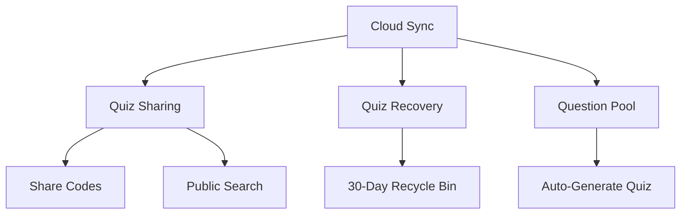

# Mobile Quiz Application

## 1. Project Overview

**QuizCode** is an Android mobile application that enables users to create, share, and take multiple-choice quizzes. The app supports both online (cloud-synced) and offline (local-first) modes.

### Key Features

| Feature | Description |
|---------|-------------|
| Quiz Creation | Manual entry or bulk import from Excel/CSV |
| Question Shuffling | Randomizes questions and choices per attempt while preserving correct answers |
| Share Codes | 6-digit codes for private quiz sharing |
| Public Library | Browse and search community quizzes |
| Guest Mode | Take quizzes without account registration |
| Question Pool | Contribute questions anonymously for auto-generated quizzes |
| Cloud Sync | Automatic backup with integrity verification |

---

## 2. Tech Stack

| Layer | Technology |
|-------|------------|
| Language | Kotlin |
| Local Database | SQLite (Room) - offline cache |
| UI Framework | Jetpack Compose |
| Backend | Firebase (serverless) |
| Cloud Database | Cloud Firestore |
| Authentication | Firebase Auth |
| Storage | Firebase Storage (media files) |

---

## 3. System Architecture

```
┌─────────────────────────────────────────────────────────────────┐
│                     QuizCode Mobile App                         │
│                         (Kotlin)                                │
├─────────────────────────────────────────────────────────────────┤
│  ┌──────────────┐  ┌──────────────┐  ┌──────────────┐           │
│  │   UI Layer   │  │  ViewModel   │  │  Repository  │           │
│  │   (Compose)  │◄─┤   (MVVM)     │◄─┤   Pattern    │           │
│  └──────────────┘  └──────────────┘  └──────┬───────┘           │
│                                             │                   │
│  ┌──────────────────────────────────────────┴───────────────┐   │
│  │                    Data Sources                          │   │
│  │  ┌─────────────────┐        ┌─────────────────┐          │   │
│  │  │  Room Database  │        │  Firebase SDK   │          │   │
│  │  │ (Offline Cache) │        │  (Cloud Sync)   │          │   │
│  │  └────────┬────────┘        └────────┬────────┘          │   │
│  └───────────┼──────────────────────────┼───────────────────┘   │
└──────────────┼──────────────────────────┼───────────────────────┘
               │                          │
       ┌───────▼───────┐          ┌───────▼───────┐
       │  Local SQLite │          │    Firebase   │
       │    Storage    │          │     Cloud     │
       └───────────────┘          └───────────────┘
                                          │
                          ┌───────────────┼───────────────┐
                          ▼               ▼               ▼
                    ┌──────────┐   ┌──────────┐   ┌──────────┐
                    │Firestore │   │   Auth   │   │ Storage  │
                    │(Database)│   │ (Login)  │   │ (Media)  │
                    └──────────┘   └──────────┘   └──────────┘
```

---

## 4. User Roles

### 4.1 Owner (Authenticated User)
- Create/edit/delete quizzes
- Import from Excel/CSV
- Generate 6-digit share codes
- View attempt statistics
- Contribute questions to public pool
- Auto-generate quizzes from pool

### 4.2 Guest (Unauthenticated)
- Join quiz via 6-digit code
- Browse public quizzes
- Take quizzes and view own scores
- No account required

---

## 5. Core Business Rules

### Quiz Sharing
| Mode | Access Method |
|------|---------------|
| Private | 6-digit share code only |
| Public | Searchable without code |

### Tags & Metadata
- Tags set at quiz level
- Questions inherit quiz tags by default
- Per-question tag override (optional)

### Media Support
| Type | Formats |
|------|---------|
| Image | JPG, PNG, WebP |
| Video | MP4, Stream URL |

> Media displays above question text when `media_url` is not null.

### Flexible Choice Architecture

The quiz system supports **dynamic number of answer choices** (2 to 10 per question):

| Question Type | Choices | Use Case |
|---------------|---------|----------|
| True/False | 2 | Simple binary questions |
| Standard MCQ | 4 | Traditional multiple choice |
| Extended MCQ | 5-10 | Complex questions with more options |

**Key Features:**
- **Minimum**: 2 choices required per question
- **Maximum**: 10 choices allowed per question
- **Multiple Correct**: Optional support for questions with multiple correct answers
- **Dynamic UI**: Choice buttons render based on question's choice count
- **Validation**: Server and client validate choice count constraints

```
┌─────────────────────────────────────────────────────────┐
│                FLEXIBLE CHOICE MODEL                    │
├─────────────────────────────────────────────────────────┤
│  Question                                               │
│  ├── choiceCount: 2-10 (flexible)                       │
│  ├── allowMultipleCorrect: boolean                      │
│  │                                                      │
│  └── choices[] (2 to 10 items)                          │
│      ├── Choice A (isCorrect: true/false)               │
│      ├── Choice B (isCorrect: true/false)               │
│      ├── ...                                            │
│      └── Choice N (max 10)                              │
└─────────────────────────────────────────────────────────┘
```

---

## 6. Sync Algorithm (Cloud Backup)

```
┌─────────────────────────────────────────────────────────────┐
│                    Upload Flow                              │
├─────────────────────────────────────────────────────────────┤
│  1. Client computes SHA-256 checksum of quiz data           │
│  2. Upload quiz + metadata + checksum to Firestore          │
│  3. Firestore stores data with checksum field               │
│  4. Client verifies by reading back and comparing checksum  │
│  5. Compare checksums:                                      │
│     ├─ Match → Mark sync complete ✓                         │
│     └─ Mismatch → Delete corrupted data, client retries     │
└─────────────────────────────────────────────────────────────┘
```

### Benefits
- **Data Integrity**: Detects corruption from network errors
- **Retry Safety**: Client can safely re-upload on failure
- **Clean Storage**: No partial/corrupted data persists
- **Offline First**: Firestore handles offline caching automatically

---

## 7. Feature Dependencies



> **Note:** If Mermaid doesn't render, view this diagram:
> - Cloud Sync enables Quiz Sharing and Quiz Recovery
> - Quiz Sharing enables Share Codes and Public Search
> - Cloud Sync enables Question Pool
> - Question Pool enables Auto-Generate Quiz
> - Quiz Recovery enables 30-Day Recycle Bin

---

## 8. Project Modules

| Module | Responsibility |
|--------|----------------|
| `app` | Main Android application entry |
| `ui` | Compose screens and components |
| `data` | Room entities, Firebase models, repositories |
| `firebase` | Firebase Auth, Firestore, Storage wrappers |
| `sync` | Background sync logic, checksum verification |
| `utils` | Helpers, extensions, constants |

---

## 9. Firebase Services Summary

| Service | Usage |
|---------|-------|
| **Firebase Auth** | Email/password login, Google Sign-In |
| **Cloud Firestore** | Quiz, questions, attempts, user data |
| **Firebase Storage** | Image/video uploads for questions |
| **Cloud Functions** (optional) | Share code generation, 30-day cleanup job |
