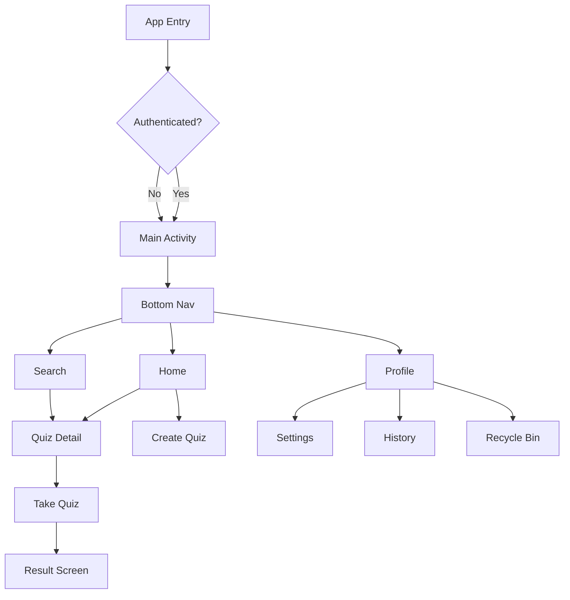
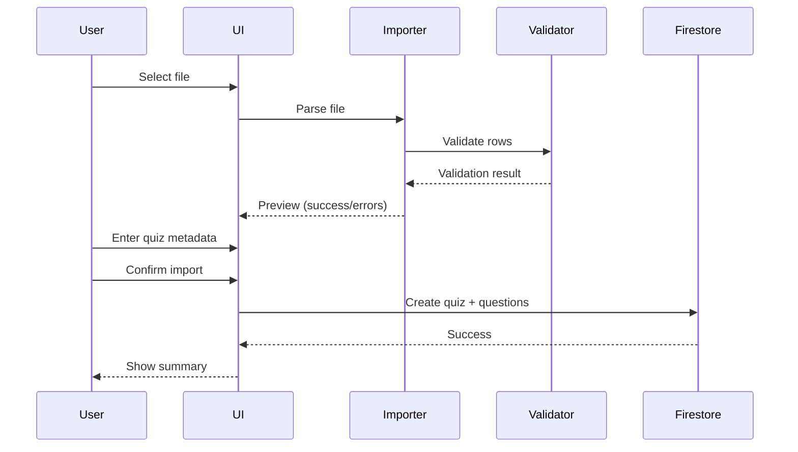

# Frontend Design & Implementation (Firebase + Kotlin)

## 1. UI Architecture

### 1.1 Navigation Structure



<details>
<summary>📊 View as Text Diagram (if Mermaid doesn't render)</summary>

```
App Entry
    │
    ▼
Authenticated? ──► Main Activity
    │                  │
    └──────────────────┘
                       │
                       ▼
                  Bottom Nav
           ┌──────────┼──────────┐
           ▼          ▼          ▼
         Home      Search     Profile
           │          │          │
     ┌─────┴─────┐    │    ┌─────┼─────┬─────┐
     ▼           ▼    │    ▼     ▼     ▼     
Quiz Detail  Create   │  Settings History Recycle Bin
     │         Quiz   │
     ▼                │
  Take Quiz ◄─────────┘
     │
     ▼
Result Screen
```

</details>

### 1.2 Screen List

| Screen | Route | Auth Required |
|--------|-------|---------------|
| Home Dashboard | `/home` | No |
| Search/Explore | `/search` | No |
| Profile | `/profile` | Yes* |
| Quiz Detail | `/quiz/{id}` | No |
| Take Quiz | `/quiz/{id}/play` | No |
| Quiz Result | `/quiz/{id}/result` | No |
| Create Quiz | `/quiz/create` | Yes |
| Edit Quiz | `/quiz/{id}/edit` | Yes |
| Settings | `/settings` | Yes |
| Attempt History | `/history` | Yes |
| Recycle Bin | `/trash` | Yes |

> *Shows login prompt if not authenticated

---

## 2. Component Library

### 2.1 Core Components

```
┌─────────────────────────────────────────────────────────────┐
│                    Reusable Components                      │
├─────────────────────────────────────────────────────────────┤
│  Navigation                                                 │
│  ├─ BottomNavBar (Home, Search, Profile)                    │
│  ├─ TopAppBar (Back, Title, Actions)                        │
│  └─ FloatingActionButton (Create Quiz)                      │
├─────────────────────────────────────────────────────────────┤
│  Quiz Display                                               │
│  ├─ QuizCard (Thumbnail, Title, Stats)                      │
│  ├─ QuestionCard (Content, Media, Choices)                  │
│  ├─ DynamicChoiceList (renders 2-10 choices dynamically)    │
│  ├─ ChoiceButton (Text, Selected State, Multi-select mode)  │
│  ├─ ChoiceCounter (shows "X of Y choices")                  │
│  └─ TagChip (Pill-style category tag)                       │
├─────────────────────────────────────────────────────────────┤
│  Feedback                                                   │
│  ├─ LoadingSpinner                                          │
│  ├─ SkeletonLoader                                          │
│  ├─ ErrorState (Message + Retry)                            │
│  └─ EmptyState (Message + CTA)                              │
├─────────────────────────────────────────────────────────────┤
│  Forms                                                      │
│  ├─ TextInputField                                          │
│  ├─ CodeInputField (6-digit)                                │
│  ├─ DropdownSelector                                        │
│  └─ SwitchToggle                                            │
└─────────────────────────────────────────────────────────────┘
```

### 2.2 QuizCard Component

```kotlin
@Composable
fun QuizCard(
    quiz: Quiz,
    onClick: () -> Unit,
    modifier: Modifier = Modifier
) {
    Card(
        modifier = modifier
            .fillMaxWidth()
            .clickable(onClick = onClick),
        elevation = CardDefaults.cardElevation(4.dp)
    ) {
        Row(
            modifier = Modifier.padding(12.dp),
            verticalAlignment = Alignment.CenterVertically
        ) {
            // Thumbnail
            AsyncImage(
                model = quiz.thumbnailUrl,
                contentDescription = null,
                modifier = Modifier
                    .size(64.dp)
                    .clip(RoundedCornerShape(8.dp)),
                contentScale = ContentScale.Crop
            )
            
            Spacer(modifier = Modifier.width(12.dp))
            
            Column(modifier = Modifier.weight(1f)) {
                Text(
                    text = quiz.title,
                    style = MaterialTheme.typography.titleMedium,
                    maxLines = 1
                )
                Text(
                    text = "by ${quiz.authorName}",
                    style = MaterialTheme.typography.bodySmall,
                    color = MaterialTheme.colorScheme.onSurfaceVariant
                )
                
                Row(
                    horizontalArrangement = Arrangement.spacedBy(8.dp),
                    modifier = Modifier.padding(top = 4.dp)
                ) {
                    quiz.tags.take(3).forEach { tag ->
                        TagChip(text = tag)
                    }
                }
            }
            
            // Stats
            Column(horizontalAlignment = Alignment.End) {
                Text(
                    text = "${quiz.questionCount} Qs",
                    style = MaterialTheme.typography.labelMedium
                )
                Text(
                    text = "${quiz.attemptCount} plays",
                    style = MaterialTheme.typography.labelSmall,
                    color = MaterialTheme.colorScheme.onSurfaceVariant
                )
            }
        }
    }
}
```

### 2.3 DynamicChoiceList Component

```kotlin
/**
 * Renders a dynamic list of choice buttons based on the question's choice count.
 * Supports 2-10 choices per question with optional multi-select mode.
 */
@Composable
fun DynamicChoiceList(
    choices: List<Choice>,
    selectedChoiceIds: Set<String>,
    allowMultipleCorrect: Boolean = false,
    onChoiceSelected: (String) -> Unit,
    modifier: Modifier = Modifier
) {
    // Validate choice count (2-10)
    require(choices.size in 2..10) { 
        "Questions must have 2-10 choices, got ${choices.size}" 
    }
    
    Column(
        modifier = modifier.fillMaxWidth(),
        verticalArrangement = Arrangement.spacedBy(8.dp)
    ) {
        // Show choice counter for questions with many options
        if (choices.size > 4) {
            Text(
                text = "${selectedChoiceIds.size} of ${choices.size} choices",
                style = MaterialTheme.typography.labelSmall,
                color = MaterialTheme.colorScheme.onSurfaceVariant
            )
        }
        
        choices.forEachIndexed { index, choice ->
            val label = ('A' + index).toString()
            val isSelected = choice.id in selectedChoiceIds
            
            ChoiceButton(
                label = label,
                content = choice.content,
                isSelected = isSelected,
                isMultiSelect = allowMultipleCorrect,
                onClick = { onChoiceSelected(choice.id) }
            )
        }
    }
}

@Composable
fun ChoiceButton(
    label: String,
    content: String,
    isSelected: Boolean,
    isMultiSelect: Boolean = false,
    onClick: () -> Unit,
    modifier: Modifier = Modifier
) {
    OutlinedCard(
        onClick = onClick,
        modifier = modifier.fillMaxWidth(),
        colors = CardDefaults.outlinedCardColors(
            containerColor = if (isSelected) 
                MaterialTheme.colorScheme.primaryContainer 
            else MaterialTheme.colorScheme.surface
        ),
        border = BorderStroke(
            width = if (isSelected) 2.dp else 1.dp,
            color = if (isSelected) 
                MaterialTheme.colorScheme.primary 
            else MaterialTheme.colorScheme.outline
        )
    ) {
        Row(
            modifier = Modifier
                .fillMaxWidth()
                .padding(16.dp),
            verticalAlignment = Alignment.CenterVertically
        ) {
            // Selection indicator (checkbox for multi, radio for single)
            if (isMultiSelect) {
                Checkbox(
                    checked = isSelected,
                    onCheckedChange = null
                )
            } else {
                RadioButton(
                    selected = isSelected,
                    onClick = null
                )
            }
            
            Spacer(modifier = Modifier.width(12.dp))
            
            Text(
                text = "$label. $content",
                style = MaterialTheme.typography.bodyLarge
            )
            
            if (isSelected) {
                Spacer(modifier = Modifier.weight(1f))
                Icon(
                    imageVector = Icons.Default.Check,
                    contentDescription = "Selected",
                    tint = MaterialTheme.colorScheme.primary
                )
            }
        }
    }
}
```

---

## 3. Screen Mockups

### 3.1 Home Dashboard

```
┌─────────────────────────────────────────────────────────────┐
│  [←]              QuizCode                           [👤]   │
├─────────────────────────────────────────────────────────────┤
│                                                             │
│  Hello, Thanh! 👋                                           │
│                                                             │
│  ┌─────────────────────────────────────────────────────┐    │
│  │  Enter quiz code    [______]  [Join →]              │    │
│  └─────────────────────────────────────────────────────┘    │
│                                                             │
│  Recently Played                                            │
│  ┌─────────┐ ┌─────────┐ ┌─────────┐                        │
│  │ Quiz 1  │ │ Quiz 2  │ │ Quiz 3  │ ──►                    │
│  └─────────┘ └─────────┘ └─────────┘                        │
│                                                             │
│  My Quizzes                                    [See All →]  │
│  ┌─────────────────────────────────────────────────────┐    │
│  │ [📷] Math Quiz 101          10 Qs   │   45 plays   │     │
│  └─────────────────────────────────────────────────────┘    │
│                                                             │
│  Trending Quizzes                              [See All →]  │
│  ┌─────────────────────────────────────────────────────┐    │
│  │ [📷] Science Trivia          ★4.5   │   500+ plays │     │
│  └─────────────────────────────────────────────────────┘    │
│                                                             │
├─────────────────────────────────────────────────────────────┤
│        [🔍]              [🏠]              [👤]             │
│       Search             Home             Profile           │
│                          [+]                                │
│                         (FAB)                               │
└─────────────────────────────────────────────────────────────┘
```

### 3.2 Take Quiz Screen

```
┌─────────────────────────────────────────────────────────────┐
│  [✕]                                           [Submit]     │
├─────────────────────────────────────────────────────────────┤
│                                                             │
│  Question 4 of 10                        ⏱ 12:45           │
│  ████████████░░░░░░░░░░░░░░░░░░░                            │
│                                                             │
│  ┌─────────────────────────────────────────────────────┐    │
│  │              [Image/Video Media]                    │    │ 
│  └─────────────────────────────────────────────────────┘    │ 
│                                                             │
│  What is the capital city of Vietnam?                       │
│                                                             │
│  ┌─────────────────────────────────────────────────────┐    │
│  │  A. Ho Chi Minh City                                │    │
│  └─────────────────────────────────────────────────────┘    │
│  ┌─────────────────────────────────────────────────────┐    │ 
│  │  B. Hanoi                               ✓ Selected  │    │
│  └─────────────────────────────────────────────────────┘    │
│  ┌─────────────────────────────────────────────────────┐    │
│  │  C. Da Nang                                         │    │
│  └─────────────────────────────────────────────────────┘    │
│  ┌─────────────────────────────────────────────────────┐    │
│  │  D. Hue                                             │    │
│  └─────────────────────────────────────────────────────┘    │
│  ┌─────────────────────────────────────────────────────┐    │
│  │  E. Can Tho                                         │    │
│  └─────────────────────────────────────────────────────┘    │
│                                                             │
│  Note: Questions support 2-10 choices (flexible)            │
│                                                             │
├─────────────────────────────────────────────────────────────┤
│           [← Previous]              [Next →]                │
└─────────────────────────────────────────────────────────────┘
```

### 3.3 Quiz Result Screen

```
┌─────────────────────────────────────────────────────────────┐
│  [←]              Quiz Complete                      [📤]   │
├─────────────────────────────────────────────────────────────┤
│                         🎉                                  │
│                    Your Score                               │
│                      8/10                                   │
│                      80%                                    │
│                    ★★★★☆                                    │
│                                                             │
│  ┌──────────────────────────────────────────────────────┐   │
│  │  ✅ Correct: 8       ❌ Wrong: 2       ⏱ 8:32       │   │
│  └──────────────────────────────────────────────────────┘   │
│                                                             │
│  ┌─────────────────────────────────────────────────────┐    │
│  │               [Review Answers]                      │    │
│  └─────────────────────────────────────────────────────┘    │
│  ┌─────────────────────────────────────────────────────┐    │
│  │               [Try Again]                           │    │
│  └─────────────────────────────────────────────────────┘    │
│  ┌─────────────────────────────────────────────────────┐    │
│  │               [Back to Home]                        │    │
│  └─────────────────────────────────────────────────────┘    │ 
│                                                             │
│  Rate this quiz:  ☆ ☆ ☆ ☆ ☆                                 │
└─────────────────────────────────────────────────────────────┘
```

---

## 4. ViewModel Patterns

### 4.1 Quiz Creation ViewModel

```kotlin
@HiltViewModel
class CreateQuizViewModel @Inject constructor(
    private val quizRepository: QuizRepository
) : ViewModel() {

    private val _uiState = MutableStateFlow(CreateQuizUiState())
    val uiState: StateFlow<CreateQuizUiState> = _uiState.asStateFlow()

    fun updateTitle(title: String) {
        _uiState.update { it.copy(title = title) }
    }

    fun addQuestion(question: QuestionDraft) {
        _uiState.update { it.copy(questions = it.questions + question) }
    }

    fun saveQuiz() {
        viewModelScope.launch {
            _uiState.update { it.copy(isSaving = true) }
            
            try {
                val quiz = createQuizFromState()
                val quizId = quizRepository.createQuiz(quiz, _uiState.value.questions)
                
                _uiState.update { 
                    it.copy(isSaving = false, savedQuizId = quizId.getOrNull()) 
                }
            } catch (e: Exception) {
                _uiState.update { it.copy(isSaving = false, error = e.message) }
            }
        }
    }

    fun importFromCsv(uri: Uri) {
        viewModelScope.launch {
            _uiState.update { it.copy(isImporting = true) }
            val result = csvImporter.import(uri)
            _uiState.update { 
                it.copy(
                    isImporting = false,
                    questions = result.questions,
                    importErrors = result.errors
                ) 
            }
        }
    }
}

data class CreateQuizUiState(
    val title: String = "",
    val description: String = "",
    val tags: List<String> = emptyList(),
    val isPublic: Boolean = false,
    val questions: List<QuestionDraft> = emptyList(),
    val shareToPool: Boolean = false,
    val isSaving: Boolean = false,
    val isImporting: Boolean = false,
    val savedQuizId: String? = null,
    val error: String? = null,
    val importErrors: List<ImportError> = emptyList()
)
```

### 4.2 Take Quiz ViewModel

```kotlin
@HiltViewModel
class TakeQuizViewModel @Inject constructor(
    private val quizRepository: QuizRepository,
    private val attemptRepository: AttemptRepository,
    savedStateHandle: SavedStateHandle
) : ViewModel() {

    private val quizId: String = savedStateHandle["quizId"]!!
    
    private val _uiState = MutableStateFlow<TakeQuizUiState>(TakeQuizUiState.Loading)
    val uiState: StateFlow<TakeQuizUiState> = _uiState.asStateFlow()

    private lateinit var attempt: Attempt
    private val answers = mutableMapOf<String, String>()

    init { loadQuiz() }

    private fun loadQuiz() {
        viewModelScope.launch {
            val quizData = quizRepository.getQuizWithQuestions(quizId)
            
            // Shuffle questions and choices
            val shuffledQuestions = quizData.questions.shuffled()
            val shuffledChoices = shuffledQuestions.associate { q ->
                q.id to q.choices.shuffled()
            }
            
            // Create attempt in Firestore
            attempt = attemptRepository.createAttempt(
                quizId = quizId,
                userId = Firebase.auth.currentUser?.uid,
                questions = shuffledQuestions
            )
            
            _uiState.value = TakeQuizUiState.Active(
                questions = shuffledQuestions,
                choiceOrders = shuffledChoices,
                currentIndex = 0,
                answers = emptyMap(),
                startTime = System.currentTimeMillis()
            )
        }
    }

    fun selectAnswer(questionId: String, choiceId: String) {
        answers[questionId] = choiceId
        updateState { it.copy(answers = answers.toMap()) }
    }

    fun submitQuiz() {
        viewModelScope.launch {
            val activeState = _uiState.value as? TakeQuizUiState.Active ?: return@launch
            
            // Calculate score
            var score = 0
            activeState.questions.forEach { q ->
                val selectedChoiceId = answers[q.id]
                val correctChoice = q.choices.find { it.isCorrect }
                if (selectedChoiceId == correctChoice?.id) {
                    score += q.points
                }
            }
            
            // Save to Firestore
            attemptRepository.submitAttempt(attempt.id, answers, score)
            
            _uiState.value = TakeQuizUiState.Completed(
                score = score,
                maxScore = activeState.questions.sumOf { it.points },
                timeTaken = System.currentTimeMillis() - activeState.startTime
            )
        }
    }
}

sealed class TakeQuizUiState {
    object Loading : TakeQuizUiState()
    data class Active(
        val questions: List<Question>,
        val choiceOrders: Map<String, List<Choice>>,
        val currentIndex: Int,
        val answers: Map<String, String>,
        val startTime: Long
    ) : TakeQuizUiState()
    data class Completed(
        val score: Int,
        val maxScore: Int,
        val timeTaken: Long
    ) : TakeQuizUiState()
}
```

---

## 5. Firebase Integration

### 5.1 Firebase Setup (Hilt Module)

```kotlin
@Module
@InstallIn(SingletonComponent::class)
object FirebaseModule {
    
    @Provides
    @Singleton
    fun provideFirebaseAuth(): FirebaseAuth = Firebase.auth
    
    @Provides
    @Singleton
    fun provideFirestore(): FirebaseFirestore = Firebase.firestore
    
    @Provides
    @Singleton
    fun provideFirebaseStorage(): FirebaseStorage = Firebase.storage
}
```

### 5.2 Repository with Firebase

```kotlin
class QuizRepository @Inject constructor(
    private val firestore: FirebaseFirestore,
    private val quizDao: QuizDao // Room for offline cache
) {
    private val quizzesRef = firestore.collection("quizzes")
    
    // Real-time updates with offline cache
    fun getMyQuizzes(userId: String): Flow<List<Quiz>> = callbackFlow {
        val listener = quizzesRef
            .whereEqualTo("ownerId", userId)
            .whereEqualTo("deletedAt", null)
            .orderBy("updatedAt", Query.Direction.DESCENDING)
            .addSnapshotListener { snapshot, error ->
                if (error != null) { close(error); return@addSnapshotListener }
                val quizzes = snapshot?.toObjects(Quiz::class.java) ?: emptyList()
                trySend(quizzes)
                
                // Cache to Room for offline
                launch { quizDao.insertAll(quizzes.map { it.toEntity() }) }
            }
        awaitClose { listener.remove() }
    }.catch {
        // Fallback to Room cache when offline
        emitAll(quizDao.getAllQuizzes().map { it.map { e -> e.toDomain() } })
    }
    
    // Get quiz by share code
    suspend fun getQuizByShareCode(code: String): Quiz? {
        val codeDoc = firestore.collection("shareCodes")
            .document(code).get().await()
        if (!codeDoc.exists()) return null
        
        val quizId = codeDoc.getString("quizId") ?: return null
        return quizzesRef.document(quizId).get().await().toObject(Quiz::class.java)
    }
    
    // Create quiz with all questions
    suspend fun createQuiz(quiz: Quiz, questions: List<QuestionDraft>): Result<String> {
        return try {
            val batch = firestore.batch()
            val quizRef = quizzesRef.document()
            
            // Compute checksum
            val checksum = ChecksumUtil.computeChecksum(quiz.title, questions)
            
            val quizData = quiz.copy(
                id = quizRef.id,
                shareCode = generateShareCode(),
                checksum = checksum,
                questionCount = questions.size
            )
            batch.set(quizRef, quizData)
            
            // Create share code lookup
            quizData.shareCode?.let { code ->
                val codeRef = firestore.collection("shareCodes").document(code)
                batch.set(codeRef, mapOf("quizId" to quizRef.id))
            }
            
            // Create questions
            questions.forEachIndexed { idx, q ->
                val qRef = quizRef.collection("questions").document()
                batch.set(qRef, q.copy(id = qRef.id, position = idx))
                
                // Create choices
                q.choices.forEachIndexed { cIdx, c ->
                    val cRef = qRef.collection("choices").document()
                    batch.set(cRef, c.copy(id = cRef.id, position = cIdx))
                }
            }
            
            batch.commit().await()
            Result.success(quizRef.id)
        } catch (e: Exception) {
            Result.failure(e)
        }
    }
    
    private fun generateShareCode(): String {
        val chars = "ABCDEFGHIJKLMNOPQRSTUVWXYZ0123456789"
        return (1..6).map { chars.random() }.joinToString("")
    }
}
```

---

## 6. Offline Support

### 6.1 Firestore Offline Persistence

```kotlin
// Enable in Application class
class QuizCodeApp : Application() {
    override fun onCreate() {
        super.onCreate()
        
        // Enable Firestore offline persistence (enabled by default)
        Firebase.firestore.firestoreSettings = firestoreSettings {
            isPersistenceEnabled = true
            cacheSizeBytes = FirebaseFirestoreSettings.CACHE_SIZE_UNLIMITED
        }
    }
}
```

### 6.2 Network Monitor

```kotlin
class NetworkMonitor @Inject constructor(
    @ApplicationContext private val context: Context
) {
    private val connectivityManager = 
        context.getSystemService<ConnectivityManager>()!!
    
    val isOnline: StateFlow<Boolean> = callbackFlow {
        val callback = object : ConnectivityManager.NetworkCallback() {
            override fun onAvailable(network: Network) { trySend(true) }
            override fun onLost(network: Network) { trySend(false) }
        }
        connectivityManager.registerDefaultNetworkCallback(callback)
        trySend(connectivityManager.activeNetwork != null)
        awaitClose { connectivityManager.unregisterNetworkCallback(callback) }
    }.stateIn(CoroutineScope(Dispatchers.IO), SharingStarted.Eagerly, false)
}
```

### 6.3 Data Saver Mode

```kotlin
class SyncPreferences @Inject constructor(
    private val dataStore: DataStore<Preferences>
) {
    private val dataSaverKey = booleanPreferencesKey("data_saver_enabled")
    
    val dataSaverEnabled: Flow<Boolean> = dataStore.data
        .map { it[dataSaverKey] ?: false }
    
    suspend fun setDataSaverEnabled(enabled: Boolean) {
        dataStore.edit { it[dataSaverKey] = enabled }
    }
}
```

---

## 7. CSV/Excel Import

### 7.1 Import Flow



<details>
<summary>📊 View as Text Diagram (if Mermaid doesn't render)</summary>

```
User          UI           Importer       Validator       Firestore
  │            │               │              │               │
  │──Select────►               │              │               │
  │  file      │               │              │               │
  │            │──Parse file──►│              │               │
  │            │               │──Validate───►│               │
  │            │               │◄──Result─────│               │
  │            │◄──Preview─────│              │               │
  │──Enter─────►               │              │               │
  │  metadata  │               │              │               │
  │──Confirm───►               │              │               │
  │            │──────────Create quiz────────►│               │
  │            │◄─────────Success─────────────│               │
  │◄──Summary──│               │              │               │
```

</details>
    Importer->>Validator: Validate rows
    Validator-->>Importer: Validation result
    Importer-->>UI: Preview (success/errors)
    User->>UI: Enter quiz metadata
    User->>UI: Confirm import
    UI->>Firestore: Create quiz + questions
    Firestore-->>UI: Success
    UI-->>User: Show summary
```

### 7.2 CSV Parser

```kotlin
class CsvImporter @Inject constructor(
    @ApplicationContext private val context: Context
) {
    private val requiredColumns = setOf(
        "question", "option_0", "option_1", "option_2", "option_3", "correct_option"
    )
    
    suspend fun import(uri: Uri): ImportResult = withContext(Dispatchers.IO) {
        val questions = mutableListOf<QuestionDraft>()
        val errors = mutableListOf<ImportError>()
        
        context.contentResolver.openInputStream(uri)?.use { stream ->
            val reader = BufferedReader(InputStreamReader(stream))
            val headers = reader.readLine()?.split(",") ?: return@use
            
            val missingHeaders = requiredColumns - headers.toSet()
            if (missingHeaders.isNotEmpty()) {
                return@withContext ImportResult(
                    emptyList(),
                    listOf(ImportError(0, "Missing columns: $missingHeaders"))
                )
            }
            
            var lineNumber = 1
            reader.forEachLine { line ->
                lineNumber++
                try {
                    questions.add(parseQuestion(headers, line.split(",")))
                } catch (e: Exception) {
                    errors.add(ImportError(lineNumber, e.message ?: "Parse error"))
                }
            }
        }
        ImportResult(questions, errors)
    }
}
```

---

## 8. Question Pool & Auto-Generate

### 8.1 Pool Repository

```kotlin
class PoolRepository @Inject constructor(
    private val firestore: FirebaseFirestore
) {
    private val poolRef = firestore.collection("questionPool")
    
    suspend fun contributeQuestions(
        questions: List<Question>,
        sourceQuizId: String,
        isAnonymized: Boolean
    ) {
        val batch = firestore.batch()
        questions.forEach { q ->
            val poolDoc = poolRef.document()
            batch.set(poolDoc, PoolQuestion(
                id = poolDoc.id,
                content = q.content,
                choices = q.choices.map { PoolChoice(it.content, it.isCorrect) },
                correctIndex = q.choices.indexOfFirst { it.isCorrect },
                tags = q.tags,
                mediaUrl = q.mediaUrl,
                points = q.points,
                sourceQuizId = sourceQuizId,
                contributorId = if (isAnonymized) null else Firebase.auth.currentUser?.uid,
                isActive = true
            ))
        }
        batch.commit().await()
    }
    
    suspend fun getRandomQuestions(
        tags: List<String>,
        count: Int
    ): List<PoolQuestion> {
        return poolRef
            .whereEqualTo("isActive", true)
            .whereArrayContainsAny("tags", tags)
            .limit(count.toLong() * 3) // Get more, then filter
            .get()
            .await()
            .toObjects(PoolQuestion::class.java)
            .shuffled()
            .take(count)
    }
}
```
