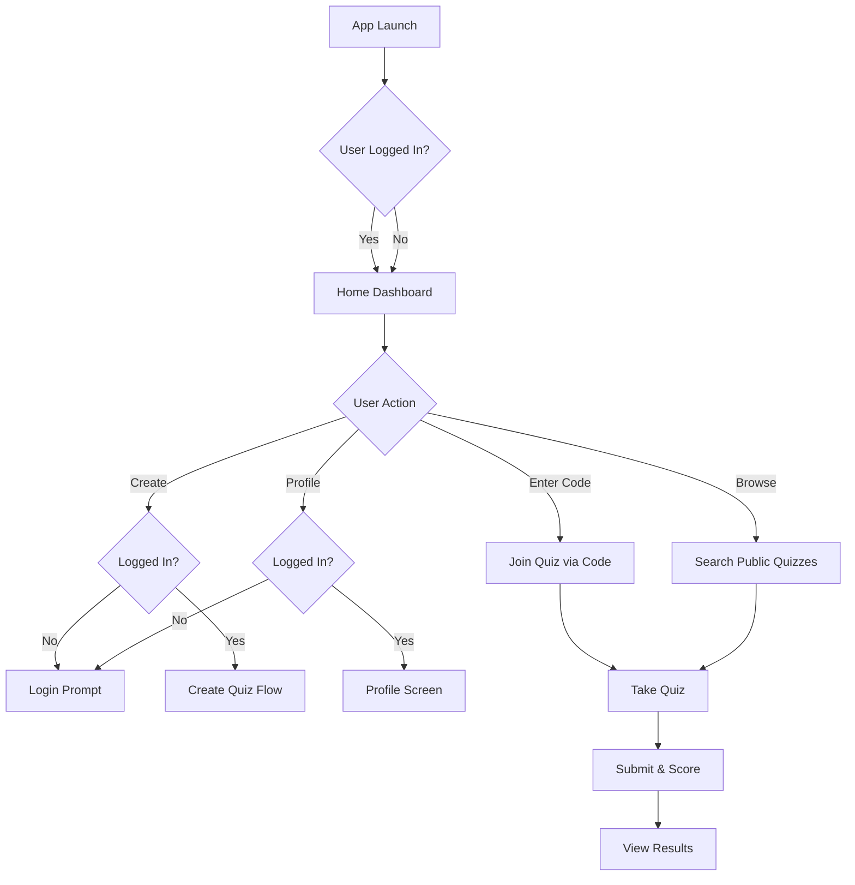
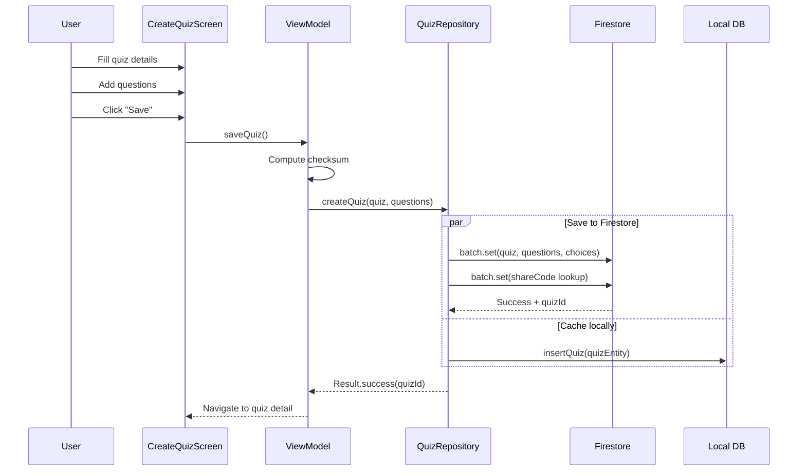
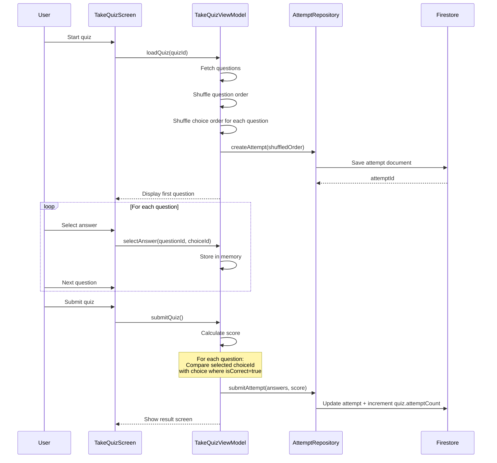
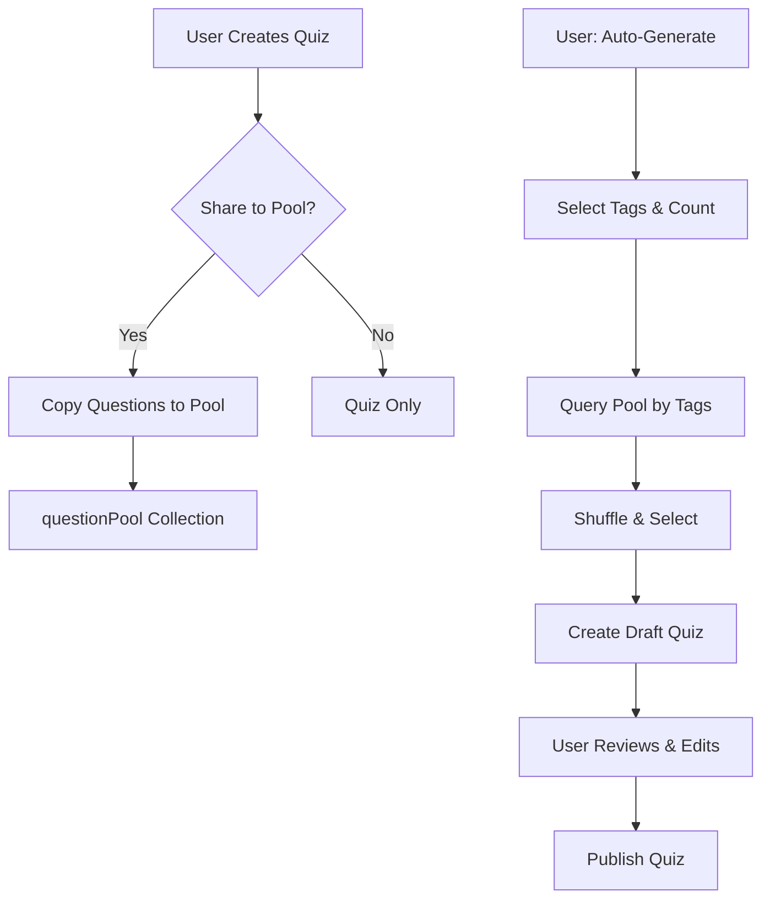

# Application Behavior & Business Logic

## 1. Application Flow Overview



<details>
<summary>📊 View as Text Diagram (if Mermaid doesn't render)</summary>

```
                        App Launch
                            │
                            ▼
                    User Logged In?
                      /         \
                   Yes           No
                      \         /
                       ▼       ▼
                    Home Dashboard
                          │
                          ▼
                     User Action
           ┌────────┬─────┴────┬────────┐
           ▼        ▼          ▼        ▼
      Enter Code  Browse    Create   Profile
           │        │          │        │
           │        │     Logged In? Logged In?
           │        │       /   \     /   \
           │        │     No    Yes No    Yes
           │        │      │     │   │     │
           │        │      ▼     ▼   ▼     ▼
           │        │   Login  Create Login Profile
           │        │   Prompt  Quiz  Prompt Screen
           │        │          Flow
           ▼        ▼
     Join Quiz via Code ──► Search Public Quizzes
                │                    │
                └──────────┬─────────┘
                           ▼
                       Take Quiz
                           │
                           ▼
                     Submit & Score
                           │
                           ▼
                      View Results
```

</details>

---

## 2. Data Flow Architecture

### 2.1 Local-First with Cloud Sync

```
┌─────────────────────────────────────────────────────────────────┐
│                         USER ACTION                             │
│                    (Create/Edit/Delete Quiz)                    │
└─────────────────────────────────────┬───────────────────────────┘
                                      │
                                      ▼
┌─────────────────────────────────────────────────────────────────┐
│                      1. SAVE TO ROOM (Local)                    │
│                         Immediate response                      │
│                         syncStatus = PENDING                    │
└─────────────────────────────────────┬───────────────────────────┘
                                      │
                                      ▼
┌─────────────────────────────────────────────────────────────────┐
│                    2. TRIGGER CLOUD SYNC                        │
│              (Background - WorkManager / Coroutine)             │
└─────────────────────────────────────┬───────────────────────────┘
                                      │
              ┌───────────────────────┴───────────────────────┐
              │                                               │
              ▼                                               ▼
┌─────────────────────────┐                   ┌─────────────────────────┐
│   NETWORK AVAILABLE     │                   │   NETWORK UNAVAILABLE   │
│                         │                   │                         │
│ - Compute checksum      │                   │ - Keep syncStatus =     │
│ - Upload to Firestore   │                   │   PENDING               │
│ - Verify checksum       │                   │ - Retry when online     │
│ - Update syncStatus     │                   │                         │
└─────────────────────────┘                   └─────────────────────────┘
```

### 2.2 Reading Data Flow

```
┌─────────────────────────────────────────────────────────────────┐
│                       USER REQUESTS DATA                        │
│                      (e.g., View My Quizzes)                    │
└─────────────────────────────────────┬───────────────────────────┘
                                      │
                                      ▼
┌─────────────────────────────────────────────────────────────────┐
│              FIRESTORE SNAPSHOT LISTENER                        │
│         (Real-time updates when connected)                      │
└─────────────────────────────────────┬───────────────────────────┘
                                      │
              ┌───────────────────────┴───────────────────────┐
              │                                               │
              ▼                                               ▼
┌─────────────────────────┐                   ┌─────────────────────────┐
│     ONLINE MODE         │                   │     OFFLINE MODE        │
│                         │                   │                         │
│ - Fetch from Firestore  │                   │ - Firestore serves      │
│ - Cache to Room         │                   │   from local cache      │
│ - Display to user       │                   │ - Fallback to Room      │
└─────────────────────────┘                   └─────────────────────────┘
```

---

## 3. Core Features - How They Work

### 3.1 Quiz Creation



**Business Rules:**
1. Quiz must have at least 1 question
2. Each question must have **2 to 10 choices** (flexible, not fixed)
3. At least 1 choice must be marked correct (supports single or multiple correct answers)
4. Share code is auto-generated (6 alphanumeric characters)
5. Checksum is computed from: title + description + all questions + all choices

> **Note:** The flexible choice system allows quiz creators to design questions with varying complexity - from simple True/False (2 choices) to comprehensive questions with up to 10 options.

---

### 3.2 Quiz Sharing (Share Code)

```
┌─────────────────────────────────────────────────────────────────┐
│                    SHARE CODE SYSTEM                            │
├─────────────────────────────────────────────────────────────────┤
│                                                                 │
│  quizzes/{quizId}                                               │
│  ├── shareCode: "ABC123"                                        │
│  └── isPublic: false                                            │
│                                                                 │
│  shareCodes/ABC123                  ◄─── Fast lookup collection │
│  └── quizId: "{quizId}"                                         │
│                                                                 │
├─────────────────────────────────────────────────────────────────┤
│  FLOW:                                                          │
│  1. User enters "ABC123"                                        │
│  2. App queries shareCodes/ABC123                               │
│  3. Gets quizId                                                 │
│  4. Fetches quiz from quizzes/{quizId}                          │
│  5. User can now take the quiz                                  │
└─────────────────────────────────────────────────────────────────┘
```

**Visibility Rules:**

| isPublic | shareCode | Access |
|----------|-----------|--------|
| `false` | Required | Only users with the 6-digit code can access |
| `true` | Optional | Appears in public search, code still works |

**Regenerate Code:**
- Owner can generate a new code anytime
- Old code is deleted from `shareCodes` collection
- New code is created
- Anyone with old code can no longer access

---

### 3.3 Taking a Quiz (Shuffle & Score)



**Shuffle Algorithm:**
```kotlin
// 1. Shuffle questions
val shuffledQuestions = questions.shuffled()
val questionOrder = shuffledQuestions.map { it.id }

// 2. Shuffle choices for each question
val choiceOrders = shuffledQuestions.associate { q ->
    q.id to q.choices.shuffled().map { it.id }
}

// 3. Save order in attempt document
attempt = Attempt(
    questionOrder = questionOrder,      // ["q3", "q1", "q5", ...]
    choiceOrders = choiceOrders         // {"q3": ["c2","c0","c3","c1"], ...}
)
```

**Scoring Logic:**
```kotlin
var score = 0
questions.forEach { question ->
    val userChoice = answers[question.id]       // choiceId user selected
    val correctChoice = question.choices.find { it.isCorrect }
    if (userChoice == correctChoice?.id) {
        score += question.points
    }
}
```

**Data Stored:**
- `questionOrder`: Array of question IDs in shuffled order
- `choiceOrders`: Map of questionId → array of choiceIds in shuffled order
- `answers`: Map of questionId → selected choiceId
- `score`: Final calculated score
- `startedAt` / `finishedAt`: Timestamps for duration calculation

---

### 3.4 Cloud Sync with Checksum Verification

```
┌─────────────────────────────────────────────────────────────────┐
│                    UPLOAD WITH INTEGRITY CHECK                  │
├─────────────────────────────────────────────────────────────────┤
│                                                                 │
│  CLIENT                                      FIRESTORE          │
│  ───────                                     ─────────          │
│                                                                 │
│  1. Build quiz data                                             │
│     ┌─────────────────┐                                         │
│     │ title           │                                         │
│     │ description     │                                         │
│     │ questions[]     │                                         │
│     │ └─ choices[]    │                                         │
│     └─────────────────┘                                         │
│                                                                 │
│  2. Compute SHA-256 checksum ──────────────────┐                │
│     checksum = SHA256(title + desc +            │               │
│                       questions + choices)      │               │
│                                                 ▼               │
│  3. Upload data + checksum ─────────────────► STORE             │
│                                                                 │
│  4. Read back document ◄─────────────────────── READ            │
│                                                                 │
│  5. Compare checksums                                           │
│     ┌──────────────────────────────────────┐                    │
│     │ localChecksum == remoteChecksum?     │                    │
│     │ ├─ YES → syncStatus = SYNCED ✓       │                    │
│     │ └─ NO  → Delete + Retry ✗            │                    │
│     └──────────────────────────────────────┘                    │
│                                                                 │
└─────────────────────────────────────────────────────────────────┘
```

**Why Checksum?**
- Network errors can corrupt data during upload
- Partial uploads may succeed (quiz saved, but questions missing)
- Checksum ensures ALL data transferred correctly
- If mismatch: delete corrupted data, client retries fresh

**Checksum Computation:**
```kotlin
fun computeChecksum(quiz: Quiz, questions: List<Question>): String {
    val data = buildString {
        append(quiz.title)
        append(quiz.description ?: "")
        questions.sortedBy { it.position }.forEach { q ->
            append(q.content)
            append(q.mediaUrl ?: "")
            q.choices.sortedBy { it.position }.forEach { c ->
                append(c.content)
                append(c.isCorrect)
            }
        }
    }
    return MessageDigest.getInstance("SHA-256")
        .digest(data.toByteArray())
        .joinToString("") { "%02x".format(it) }
}
```

---

### 3.5 Quiz Recovery (30-Day Recycle Bin)

```
┌─────────────────────────────────────────────────────────────────┐
│                    SOFT DELETE SYSTEM                           │
├─────────────────────────────────────────────────────────────────┤
│                                                                 │
│  ACTIVE QUIZ                          DELETED QUIZ              │
│  ─────────────                        ────────────              │
│  deletedAt: null                      deletedAt: 2024-01-15     │
│                                                                 │
│                          DELETE                                 │
│           ─────────────────────────────────►                    │
│                                                                 │
│                          RESTORE                                │
│           ◄─────────────────────────────────                    │
│                                                                 │
├─────────────────────────────────────────────────────────────────┤
│                                                                 │
│  CLEANUP PROCESS (Cloud Function - runs daily):                 │
│                                                                 │
│  1. Query quizzes WHERE deletedAt < (now - 30 days)             │
│  2. Permanently delete quiz + questions + choices               │
│  3. Delete from shareCodes collection                           │
│                                                                 │
└─────────────────────────────────────────────────────────────────┘
```

**User Actions:**
| Action | Effect |
|--------|--------|
| Delete Quiz | Sets `deletedAt = Timestamp.now()` |
| View Recycle Bin | Query where `deletedAt IS NOT NULL` |
| Restore Quiz | Sets `deletedAt = null` |
| Permanent Delete | (Auto) After 30 days, data removed forever |

**Why Server-Side Retention?**
- User accidentally deletes → can recover within 30 days
- Local delete only removes from device
- Cloud copy remains for recovery
- After 30 days: auto-cleanup to save storage

---

### 3.6 Question Pool & Auto-Generate



<details>
<summary>📊 View as Text Diagram (if Mermaid doesn't render)</summary>

```
CONTRIBUTION FLOW:                    AUTO-GENERATE FLOW:
                                      
User Creates Quiz                     User: Auto-Generate
       │                                     │
       ▼                                     ▼
 Share to Pool?                       Select Tags & Count
    /     \                                  │
  Yes      No                                ▼
   │        │                         Query Pool by Tags
   ▼        ▼                                │
Copy to   Quiz                               ▼
  Pool    Only                        Shuffle & Select
   │                                         │
   ▼                                         ▼
questionPool                          Create Draft Quiz
Collection                                   │
                                             ▼
                                    User Reviews & Edits
                                             │
                                             ▼
                                        Publish Quiz
```

</details>

**Contribution Flow:**
1. User creates or imports a quiz
2. Checkbox: "Share questions to community pool (anonymous)"
3. If checked: questions are copied to `questionPool` collection
4. `contributorId` = null if anonymized, else = userId
5. `sourceQuizId` tracks origin for analytics

**Auto-Generate Flow:**
1. User opens "Auto Generate Quiz"
2. Selects: Tags (Math, Science, etc.) + Question count (10, 20, etc.)
3. App queries `questionPool` where `isActive = true` AND `tags` contains selected
4. Shuffles results, takes requested count
5. Creates new quiz as Draft (not published)
6. User can edit, remove questions, add more
7. User publishes → normal quiz

**Revoke Contribution:**
- User can revoke their contributed questions anytime
- Sets `isActive = false` on pool entries
- Already-generated quizzes using those questions are NOT affected
- Only future auto-generate will exclude them

---

### 3.7 Guest Mode

```
┌─────────────────────────────────────────────────────────────────┐
│                       GUEST MODE                                 │
├─────────────────────────────────────────────────────────────────┤
│                                                                  │
│  WHAT GUESTS CAN DO:                     WHAT GUESTS CANNOT DO: │
│  ─────────────────────                   ────────────────────── │
│  ✓ Enter 6-digit code                    ✗ Create quizzes       │
│  ✓ Browse public quizzes                 ✗ Edit quizzes         │
│  ✓ Take any accessible quiz              ✗ View attempt history │
│  ✓ See their score after                 ✗ Contribute to pool   │
│  ✓ Review answers (if enabled)           ✗ Access profile       │
│                                                                  │
├─────────────────────────────────────────────────────────────────┤
│                                                                  │
│  GUEST ATTEMPT TRACKING:                                         │
│                                                                  │
│  userId = "guest_" + UUID.randomUUID()                          │
│  Example: "guest_a1b2c3d4-e5f6-7890-abcd-ef1234567890"         │
│                                                                  │
│  - Stored in attempt document                                    │
│  - No persistent identity across sessions                        │
│  - Quiz owner can see "X guest attempts" in stats               │
│                                                                  │
└─────────────────────────────────────────────────────────────────┘
```

---

## 4. Data Saver Mode

```
┌─────────────────────────────────────────────────────────────────┐
│                    DATA SAVER MODE                               │
├─────────────────────────────────────────────────────────────────┤
│                                                                  │
│  SETTING: Settings → Data Saver Mode [Toggle]                  │
│                                                                  │
│  BEHAVIOR:                                                       │
│                                                                  │
│  ┌─────────────────────────────────────────────────────────┐   │
│  │                    DATA SAVER = OFF                      │   │
│  │                                                          │   │
│  │  - Sync on any network (WiFi or Mobile Data)           │   │
│  │  - Real-time Firestore listener always active           │   │
│  │  - Media loads immediately                              │   │
│  └─────────────────────────────────────────────────────────┘   │
│                                                                  │
│  ┌─────────────────────────────────────────────────────────┐   │
│  │                    DATA SAVER = ON                       │   │
│  │                                                          │   │
│  │  - Sync ONLY on unmetered (WiFi) connections            │   │
│  │  - Queued syncs wait for WiFi                           │   │
│  │  - Reduces background data usage                        │   │
│  └─────────────────────────────────────────────────────────┘   │
│                                                                  │
└─────────────────────────────────────────────────────────────────┘
```

**Implementation:**
```kotlin
val networkConstraint = if (dataSaverEnabled) {
    NetworkType.UNMETERED  // WiFi only
} else {
    NetworkType.CONNECTED  // Any network
}
```

---

## 5. Excel/CSV Import Logic

```
┌─────────────────────────────────────────────────────────────────┐
│                    CSV IMPORT PROCESS                            │
├─────────────────────────────────────────────────────────────────┤
│                                                                  │
│  EXPECTED FORMAT:                                                │
│  ────────────────                                               │
│  question,option_0,option_1,option_2,option_3,correct_option    │
│  "Capital of VN?","HCMC","Hanoi","Danang","Hue",1              │
│  "2+2=?","3","4","5","6",1                                      │
│                                                                  │
│  OPTIONAL COLUMNS:                                               │
│  question_id, media_url, points, explanation                    │
│                                                                  │
├─────────────────────────────────────────────────────────────────┤
│                                                                  │
│  VALIDATION RULES:                                               │
│  ──────────────────                                             │
│  1. Required headers must exist                                  │
│  2. correct_option must be 0, 1, 2, or 3                        │
│  3. question text cannot be empty                               │
│  4. All 4 options must have values                              │
│                                                                  │
│  ERROR HANDLING:                                                 │
│  ───────────────                                                │
│  - Invalid rows are skipped                                     │
│  - Error list shown to user: "Line 5: Invalid correct_option"  │
│  - User can proceed with valid rows only                        │
│                                                                  │
└─────────────────────────────────────────────────────────────────┘
```

---

## 6. Security Rules Summary

| Collection | Read | Write |
|------------|------|-------|
| `users` | Authenticated users | Own document only |
| `quizzes` | Public OR owner | Owner only |
| `quizzes/{id}/questions` | Same as parent quiz | Owner only |
| `attempts` | Own attempts OR quiz owner | Creator (including guests) |
| `shareCodes` | Anyone | Cloud Functions only |
| `questionPool` | Active entries only | Authenticated (contribute), Contributor (revoke) |

---

## 7. Error Handling Strategy

| Scenario | Handling |
|----------|----------|
| Network error during sync | Queue for retry, show sync pending indicator |
| Firestore offline | Use cached data, queue writes for later |
| Invalid CSV format | Show error list, allow partial import |
| Quiz not found (wrong code) | "Quiz not found" message |
| Checksum mismatch | Delete corrupted data, auto-retry upload |
| Authentication expired | Prompt re-login, preserve draft data |

---

## 8. State Management Summary

| State | Storage | Persistence |
|-------|---------|-------------|
| UI State | ViewModel + StateFlow | Memory only |
| User Session | Firebase Auth | Persistent (auto-refresh) |
| Quiz Data | Firestore + Room cache | Persistent + Synced |
| Attempt Data | Firestore | Persistent |
| Settings | DataStore | Persistent |
| Pending Syncs | Room (syncStatus field) | Persistent until synced |
