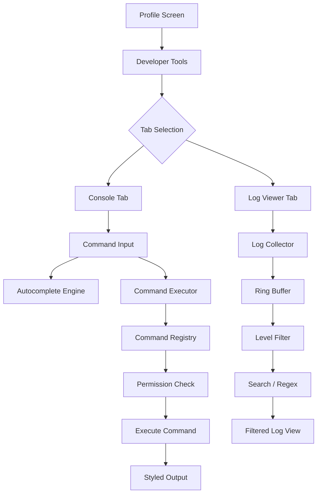
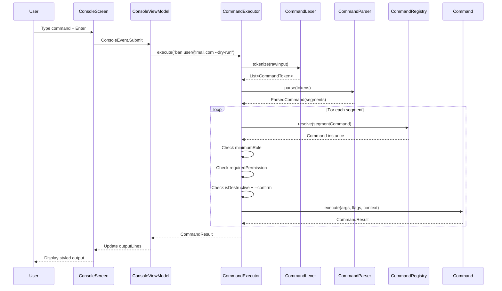

# Advanced Developer Tools: Log Viewer & In-App Console

## 1. Feature Overview

The **Advanced Developer Tools** page is a built-in diagnostic and administration interface accessible from the Profile screen. It provides two sub-features within a tabbed layout:

1. **Console** — A terminal-emulator-style command interface with autocomplete, syntax highlighting, and piping
2. **Log Viewer** — A real-time log viewer with advanced filtering



<details>
<summary>View as Text Diagram (if Mermaid doesn't render)</summary>

```
Profile Screen
      |
      v
Developer Tools
      |
      v
Tab Selection
   /       \
Console    Log Viewer
  |            |
Command    Log Collector
 Input         |
  |        Ring Buffer
  v            |
Autocomplete   Level Filter
  |            |
Command        Search / Regex
Executor       |
  |        Filtered Log View
Permission
 Check
  |
Execute
  |
Styled Output
```

</details>

---

## 2. Access Control

### 2.1 Role-Based Access Matrix

The Developer Tools page is accessible to **all logged-in users**. Guest users see a login prompt. Feature visibility is tiered by role:

| Feature | GUEST | USER | ADMIN | SUPERUSER |
|---------|-------|------|-------|-----------|
| Access Developer Tools page | No (login prompt) | Yes | Yes | Yes |
| Console: user commands | -- | Yes | Yes | Yes |
| Console: admin commands | -- | No | Per-permission | Yes |
| Console: `purge` command | -- | No | No | Yes |
| Log Viewer: INFO/WARN/ERROR/ASSERT | -- | Yes | Yes | Yes |
| Log Viewer: VERBOSE/DEBUG | -- | No | Yes | Yes |
| Log Viewer: Export | -- | Yes | Yes | Yes |

### 2.2 Command Permission Model

```
                      ┌─────────────────────────────────────────────────┐
                      │              COMMAND EXECUTION FLOW              │
                      └─────────────────────────┬───────────────────────┘
                                                │
                                                v
                      ┌─────────────────────────────────────────────────┐
                      │         1. RESOLVE COMMAND BY NAME               │
                      │         (CommandRegistry.resolve())              │
                      └─────────────────────────┬───────────────────────┘
                                                │
                              ┌─────────────────┴─────────────────┐
                              │                                   │
                              v                                   v
                        Found                              Not Found
                              │                                   │
                              v                                   v
                      ┌───────────────┐               "Command not found"
                      │ 2. ROLE CHECK │               error message
                      │ user.role >=  │
                      │ cmd.minRole   │
                      └───────┬───────┘
                              │
                    ┌─────────┴─────────┐
                    │                   │
                    v                   v
                 Passes              Fails
                    │                   │
                    v                   v
           ┌────────────────┐   "Insufficient role"
           │ 3. PERMISSION  │   error (shows required
           │    CHECK        │   role in output)
           │ user.hasPerm() │
           └───────┬────────┘
                   │
             ┌─────┴─────┐
             │           │
             v           v
          Passes      Fails
             │           │
             v           v
      ┌──────────┐  "Permission denied"
      │ 4. IF    │  error (shows which
      │ DESTRUCT │  permission is needed)
      │ --confirm│
      │ required │
      └────┬─────┘
           │
     ┌─────┴──────┐
     │            │
     v            v
 Has flag     No flag
     │            │
     v            v
 EXECUTE    "Confirmation
            required" prompt
```

Each command declares:
- **`minimumRole`**: The lowest `UserRole` that can run the command (default: `USER`)
- **`requiredPermission`**: The `AdminPermission` needed (null = no specific permission required beyond the role check)
- **`isDestructive`**: Whether the command requires `--confirm` flag or interactive confirmation

---

## 3. Console

### 3.1 Console UI Layout

```
┌─────────────────────────────────────────────────────────────┐
│  [←]            Developer Tools               [Console|Logs] │
├─────────────────────────────────────────────────────────────┤
│                                                             │
│  Welcome to Quizzez Console v1.0                            │
│  Type 'help' for a list of commands.                        │
│                                                             │
│  [thanh]$ help                                              │
│                                                             │
│  Available Commands:                                        │
│  ──────────────────────────────────────────────              │
│  COMMAND     DESCRIPTION                                    │
│  help        Show help for commands                         │
│  whoami      Show current user info                         │
│  ping        Check Firestore connectivity                   │
│  my          Query your own data                            │
│  config      View/set app settings                          │
│  cache       Manage local cache                             │
│  sync        Sync control                                   │
│  log         Query app logs                                 │
│  echo        Echo text to output                            │
│  clear       Clear console                                  │
│  history     Command history                                │
│  alias       Manage command aliases                         │
│  grep        Filter piped input                             │
│  sort        Sort piped input                               │
│  head/tail   First/last N lines                             │
│  count       Count lines/words                              │
│                                                             │
│  [thanh]$ my quizzes --tag math --sort attempts --desc      │
│                                                             │
│  ID                   TITLE           ATTEMPTS  CREATED     │
│  ──────────────────────────────────────────────────────────  │
│  abc123def456...      Math Quiz 101   45        2025-03-15  │
│  xyz789ghi012...      Algebra Test    23        2025-02-20  │
│  mno345pqr678...      Calculus Final  12        2025-01-10  │
│                                                             │
│  Showing 3 results                                          │
│                                                             │
│  [thanh]$ _                                                 │
│           ~~~~~~~~~ blinking cursor                         │
│                                                             │
├─────────────────────────────────────────────────────────────┤
│  ● Online  │  0 pending  │  Role: USER                     │
└─────────────────────────────────────────────────────────────┘
```

**Admin prompt is different:**

```
│  [admin_user]# ban user@mail.com --dry-run                  │
│  ~~~~~~~~~~~ # instead of $                                 │
```

### 3.2 Autocomplete & Input Features

#### Fish-Style Ghost Text

As the user types, the console shows a dimmed/gray "ghost text" prediction after the cursor, representing the top autocomplete suggestion:

```
│  [thanh]$ my qu|izzes                                       │
│                 ~~~~~~~ ghost text (dimmed gray)             │
│                                                             │
│  Press TAB to accept the suggestion                         │
```

#### Autocomplete Dropdown

When multiple suggestions are available, a dropdown appears above the input:

```
│  ┌──────────────────────────────────────┐                   │
│  │  CMD  my quizzes    Query my quizzes │                   │
│  │  CMD  my attempts   Query my attempts│                   │
│  │  CMD  my stats      My statistics    │ <-- selected      │
│  │  CMD  my pool       My pool items    │                   │
│  └──────────────────────────────────────┘                   │
│  [thanh]$ my _                                              │
```

Suggestion icons by type:
- `CMD` — Command/subcommand
- `FLG` — Flag (`--format`, `--sort`, etc.)
- `ARG` — Argument value
- `USR` — User suggestion (admin commands)
- `QIZ` — Quiz suggestion
- `TAG` — Tag suggestion

#### Token Highlighting

The input field colorizes tokens in real-time:

| Token Type | Color | Example |
|------------|-------|---------|
| Command name | Blue | `my`, `help`, `ban` |
| Flags | Amber/Yellow | `--format`, `-v`, `--confirm` |
| String literals | Green | `"hello world"` |
| Pipe / Semicolon | Magenta | `\|`, `;` |
| Numbers | Cyan | `100`, `365` |
| Email patterns | Specialized | `user@mail.com` |
| Unknown tokens | White (default) | arguments, values |

#### Keyboard Controls

| Key | Action |
|-----|--------|
| `Enter` | Submit command |
| `Tab` | Accept ghost text / top suggestion |
| `Up Arrow` | Navigate suggestion list up / Browse history (when no suggestions) |
| `Down Arrow` | Navigate suggestion list down |
| `Escape` | Dismiss suggestion dropdown |

### 3.3 Command Syntax

#### Basic Structure

```
command [subcommand] [arguments...] [--flags...] [--flag=value...]
```

#### Piping

Pass the output of one command to another using `|`:

```
my quizzes | grep math | count
ls -u --role admin | sort -k 2 | head 5
```

The left command's output lines become the right command's piped input. Pipe-friendly utility commands: `grep`, `sort`, `head`, `tail`, `count`.

#### Chaining

Execute multiple commands sequentially using `;`:

```
whoami; ping; sync status
```

Each command runs independently; outputs are concatenated.

#### Quoting

Use double quotes for arguments containing spaces:

```
my quizzes --search "math quiz"
echo "Hello, World!"
```

Escape special characters with backslash:

```
echo "She said \"hello\""
```

---

## 4. Command Reference

### 4.1 Commands Available to All Users (USER / ADMIN / SUPERUSER)

---

#### `help` / `h` / `?` — Command Help System

Show available commands and their usage.

**Usage:**
```
help                              # List all available commands
help <command>                    # Detailed help for a command
help --all                        # List ALL commands (including locked ones)
help --category <cat>             # Filter by category: user, quiz, system, util, pipe
help --search <text>              # Search across all help text
help ban --flags                  # Enumerate ban's flags (value vs boolean)
help ban --examples               # Show only ban's examples section
help --format json                # Output in JSON format
```

**Examples:**
```
help my                           # Detailed help for 'my' command
help --category pipe              # Show pipe utility commands
help --search "delete"            # Find all commands related to deletion
help ban --examples               # Show only ban command examples
help ls --flags                   # List all flags accepted by ls
```

---

#### `whoami` / `user` — Current User Information

Display the currently logged-in user's details.

**Usage:**
```
whoami                            # Basic info: name, email, role
whoami --verbose                  # Extended: creation date, quiz/attempt counts
whoami --permissions              # Show full permission matrix
whoami --session                  # Auth session info
whoami --format json              # Output in JSON
```

---

#### `ping` / `p` — Connectivity Check

Test connectivity to Firebase services and measure latency.

**Usage:**
```
ping                              # Default: 3 pings to Firestore
ping -c 5                         # 5 ping attempts
ping --timeout 10                 # 10-second timeout per attempt
ping -v                           # Verbose: per-attempt latency breakdown
ping --service auth               # Ping specific: firestore, auth, functions, all
```

**Example output:**
```
Pinging Firestore...
  Attempt 1: 45ms
  Attempt 2: 38ms
  Attempt 3: 42ms
Average latency: 41.7ms
Status: Online
```

---

#### `my` / `me` — Self-Service Data Query

Query your own quizzes, attempts, stats, and pool contributions. This is the primary command for regular users to explore their data.

##### `my quizzes`

```
my quizzes                                    # List all my quizzes
my quizzes --public                           # Public only
my quizzes --private                          # Private only
my quizzes --draft                            # Drafts only
my quizzes --deleted                          # Trashed quizzes
my quizzes --tag math                         # Filter by tag
my quizzes --tag math --tag science           # Multiple tags (OR)
my quizzes --tag math --tag science --and     # Multiple tags (AND)
my quizzes --search "calculus"                # Title search
my quizzes --search "calc.*" --regex          # Regex search
my quizzes --created-after 2025-01-01         # Created after date
my quizzes --created-before 2025-06-01        # Created before date
my quizzes --created-between 2025-01-01 2025-06-01  # Date range
my quizzes --updated-after 2025-01-01         # Updated after date
my quizzes --has-attempts                     # Only with attempts
my quizzes --no-attempts                      # Only without attempts
my quizzes --min-attempts 5                   # Minimum attempt count
my quizzes --max-attempts 100                 # Maximum attempt count
my quizzes --min-questions 5                  # Minimum question count
my quizzes --max-questions 50                 # Maximum question count
my quizzes --has-share-code                   # Only with share codes
my quizzes --no-share-code                    # Only without share codes
my quizzes --sort title                       # Sort by field
my quizzes --sort attempts --desc             # Sort descending
my quizzes --limit 10 --page 2               # Paginate
my quizzes --format json                      # Output: table, json, csv, compact
my quizzes --fields id,title,attempts         # Column selection
my quizzes --output count                     # Just the count
my quizzes --output ids                       # Just IDs
my quizzes --export                           # Share as text
```

##### `my attempts`

```
my attempts                                   # All my attempts
my attempts --quiz <quizId>                   # For a specific quiz
my attempts --score-above 80                  # Score >= 80%
my attempts --score-below 50                  # Score < 50%
my attempts --score-between 50 80             # Score in range
my attempts --perfect                         # 100% score only
my attempts --failed                          # <50% score only
my attempts --after 2025-01-01                # After date
my attempts --before 2025-06-01               # Before date
my attempts --between 2025-01-01 2025-06-01   # Date range
my attempts --last 7d                         # Last 7 days (also: 24h, 30m)
my attempts --duration-above 300              # Took >300 seconds
my attempts --duration-below 60               # Took <60 seconds
my attempts --completed                       # Completed only
my attempts --incomplete                      # Incomplete only
my attempts --sort score --desc               # Sort: score, date, duration, quiz
my attempts --format csv                      # Output format
my attempts --fields id,quiz,score,date       # Column selection
my attempts --output summary                  # Aggregate stats: avg score, total time
```

##### `my stats`

```
my stats                                      # Personal statistics
my stats --verbose                            # Extended stats
my stats --period 30d                         # Last 30 days
my stats --period 7d                          # Last week
my stats --breakdown                          # Breakdown by tag/category
my stats --format json                        # Output format
```

##### `my pool`

```
my pool                                       # My pool contributions
my pool --active                              # Active only
my pool --revoked                             # Revoked only
my pool --tag math                            # Filter by tag
my pool --sort usage --desc                   # Sort by usage
```

---

#### `config` / `cfg` / `settings` — Application Settings

View and modify app settings from the console.

**Usage:**
```
config                            # Show all settings with current values
config get dark_theme             # Get a specific setting
config set dark_theme dark        # Set: system, light, dark
config set auto_sync false        # Disable auto sync
config set wifi_only true         # Enable WiFi-only sync
config reset                      # Reset ALL to defaults
config reset dark_theme           # Reset one setting
config --diff                     # Show only non-default settings
config --keys                     # List only setting keys
config --verbose                  # Show descriptions
config --format json              # Output format
config --export                   # Export as shareable text
```

**Available settings:**

| Key | Values | Default | Description |
|-----|--------|---------|-------------|
| `dark_theme` | `system`, `light`, `dark` | `system` | App theme mode |
| `auto_sync` | `true`, `false` | `true` | Enable background sync |
| `wifi_only` | `true`, `false` | `false` | Sync only on WiFi |

---

#### `cache` / `ca` — Local Cache Management

Manage the Room database cache and sync operations.

**Usage:**
```
cache status                      # DB size, table counts, pending syncs
cache status --verbose            # Per-table statistics
cache clear                       # Clear all cache (requires confirmation)
cache clear -q                    # Clear quiz cache only
cache clear -a                    # Clear attempt cache only
cache clear -u                    # Clear user cache only
cache clear --dry-run             # Preview what would be cleared
cache clear --confirm             # Skip confirmation
cache sync                        # Force sync pending operations
cache retry                       # Retry failed sync operations
cache --pending                   # Show pending sync operations
cache --failed                    # Show failed sync operations
cache status --format json        # Output format
```

---

#### `sync` / `dong-bo` — Sync Control

Manage data synchronization between Room and Firestore.

> **Note:** Console sync commands bypass the user's sync preferences (auto-sync disabled, WiFi-only mode). They call `processPendingOperations()` directly without checking `isSyncAllowed()`. The `--force` flag specifically bypasses the command-level online-connectivity check, allowing sync attempts even when the device appears offline (Firestore's offline persistence will queue writes locally).

**Usage:**
```
sync                              # Show current sync state
sync now                          # Trigger full sync immediately
sync push                         # Upload pending changes only
sync pull                         # Download remote changes only
sync status                       # Detailed state report
sync status --verbose             # Per-entity-type breakdown
sync retry                        # Retry failed operations
sync now --force                  # Attempt sync even when offline
sync now --format json            # Output format (all subcommands)
sync status --format json         # Output format
```

---

#### `log` / `logs` — Query Application Logs

Query the in-memory log buffer from the console.

**Usage:**
```
log                               # Last 50 entries
log 100                           # Last 100 entries
log --level error                 # Filter by level: v, d, i, w, e, a
log --level e --level w           # Multiple levels
log --tag Firebase                # Filter by tag (prefix match)
log -t Firebase -t Room           # Multiple tags (OR)
log --search "timeout"            # Text search in message
log --regex --search "err.*time"  # Regex search
log --not --tag Coil              # Exclude tag
log --since "5m"                  # Last 5 minutes (also: 1h, 30s)
log --after "2025-04-08 10:00"    # After timestamp
log --before "2025-04-08 11:00"   # Before timestamp
log --thread main                 # Filter by thread
log --follow                      # Tail mode (live updates)
log --no-timestamp                # Hide timestamps
log --no-tag                      # Hide tags
log --clear                       # Clear log buffer
log --count --level error         # Count matching entries
log --stats                       # Per-level count summary
log --format json                 # Output format
log --export                      # Export as shareable text
```

> **Note:** Regular users (`USER` role) can only query `INFO`, `WARN`, `ERROR`, and `ASSERT` levels. `--level v` and `--level d` are silently ignored for non-admin users. Admin and Superuser accounts see all levels.

---

#### `echo` / `print` — Echo Text

Output text to the console. Useful for testing pipes and scripts.

```
echo hello world                  # Print text
echo --style success "Done!"      # Styled: success, error, warning, info, header, muted
echo -r 3 "line"                  # Repeat 3 times
echo --upper "hello"              # HELLO
echo --lower "HELLO"              # hello
echo --trim "  spaced  "         # Trim whitespace
echo --timestamp "event started"  # Prefix with timestamp
```

---

#### `clear` / `cls` / `clr` — Clear Console

Clears all output from the console display. No flags.

```
clear
```

---

#### `history` / `hist` — Command History

View and manage past commands.

```
history                           # Full command history
history 10                        # Last 10 commands
history --search "ban"            # Search history
history --regex --search "^ls"    # Regex search
history --clear                   # Clear history
history --unique                  # Deduplicate
history --reverse                 # Reverse order
history --since "10m"             # Last 10 minutes
history --format csv              # Output format
history --export                  # Export as text
```

---

#### `alias` — Command Aliases

Create shortcut aliases for frequently used commands.

```
alias                             # List all aliases
alias ll="ls -u --verbose"        # Create alias
alias myq="my quizzes --sort attempts --desc"
alias --remove ll                 # Remove alias
alias --clear                     # Remove all
```

After creating an alias, use it like any command:
```
ll                                # Equivalent to: ls -u --verbose
myq --tag math                    # Equivalent to: my quizzes --sort attempts --desc --tag math
```

---

#### Pipe Utility Commands

These commands are designed to filter, transform, and analyze piped output.

##### `grep` / `filter`

```
my quizzes | grep math            # Lines containing "math"
ls -u | grep -i admin             # Case-insensitive
ls -u | grep -v banned            # Lines NOT containing "banned"
ls -u | grep -r "^admin.*@"      # Regex mode
ls -u | grep -c admin             # Count matching lines
ls -a | grep -w quiz              # Whole word match
ls -u | grep -m 5 admin           # Stop after 5 matches
ls -u | grep -C 2 error           # Show 2 lines of context around match
```

##### `sort`

```
my quizzes | sort                 # Alphabetical sort
my quizzes | sort -r              # Reverse
ls -a | sort -n                   # Numeric sort
ls -u | sort -k 2                 # Sort by 2nd field
ls -u | sort -u                   # Remove duplicates
ls -q | sort --random             # Shuffle
ls -u | sort -f                   # Case-insensitive
```

##### `head` / `tail`

```
my attempts | head 5              # First 5 lines
my attempts | tail 10             # Last 10 lines
ls -u | head -n 20                # First 20 lines
ls -q | tail --numbered           # With line numbers
```

##### `count` / `wc`

```
my quizzes | count                # Count lines
ls -u | count -w                  # Count words
ls -u | count --unique            # Count unique lines
ls -u | count --non-empty         # Count non-empty lines
ls -u | count --by-field 2        # Count per unique value of field 2
```

---

### 4.2 Admin-Only Commands (ADMIN / SUPERUSER)

These commands are **only visible and executable** by users with `UserRole.ADMIN` or `UserRole.SUPERUSER`. Each command also requires a specific `AdminPermission`.

> When a regular user tries to run an admin command, they receive a styled error:
> ```
> Error: This command requires ADMIN role or higher.
> Your current role: USER
> ```

---

#### `ls` / `list` — List Entities

The universal listing command for admins to browse all system data.

##### `ls -u` (Users) — Requires `MANAGE_USERS`

```
ls -u                                         # All users
ls -u --role admin                            # Filter by role
ls -u --banned                                # Banned users only
ls -u --active                                # Non-banned only
ls -u --not --role guest                      # Exclude guests
ls -u --search "john"                         # Name/email search
ls -u --regex --search ".*@gmail\.com$"       # Regex search
ls -u --has-quizzes                           # Users with quizzes
ls -u --no-quizzes                            # Users without quizzes
ls -u --min-quizzes 5                         # Min quiz count
ls -u --inactive-days 30                      # Inactive 30+ days
ls -u --active-days 7                         # Active within 7 days
ls -u --created-after 2025-01-01              # Account created after
ls -u --email-domain gmail.com                # Filter by email domain
ls -u --has-permissions                       # Users with any permissions
ls -u --permission MANAGE_USERS               # Users with specific perm
ls -u --sort role --desc                      # Sort by: name, email, role, created, updated
ls -u --fields id,email,role                  # Column selection
ls -u --limit 50 --page 2                    # Paginate
ls -u --format json                           # Output: table, json, csv, compact
ls -u --output count                          # Just the count
ls -u --export                                # Export as text
```

##### `ls -q` (Quizzes) — Requires `MANAGE_QUIZZES`

All flags from `my quizzes` plus admin-specific:

```
ls -q                                         # All quizzes
ls -q --owner user@email.com                  # By specific owner
ls -q --deleted                               # Soft-deleted only
ls -q --include-deleted                       # Include soft-deleted
ls -q --removed-from-cloud                    # Flagged as removed from Firestore
ls -q --checksum                              # Show checksum in output
ls -q --sort attempts --desc                  # Sort fields: title, created, updated, attempts, questions, owner
```

##### `ls -a` (Attempts) — Requires `MANAGE_QUIZZES`

```
ls -a                                         # All attempts
ls -a --user user@email.com                   # By user
ls -a --quiz <quizId>                         # By quiz
ls -a --orphan                                # Attempts for deleted quizzes
ls -a --sort score --desc                     # Sort: score, date, duration, user, quiz
```

##### `ls -p` (Pool Items) — Requires `MANAGE_QUIZZES`

```
ls -p                                         # All pool items
ls -p --tag science                           # By tag
ls -p --contributor user@mail.com             # By contributor
ls -p --active / --revoked                    # By status
ls -p --sort usage --desc                     # Sort: usage, created, tag, contributor
```

---

#### `ban` — Ban Users — Requires `BAN_USERS`

```
ban user@email.com                            # Ban by email
ban <userId>                                  # Ban by user ID
ban u1@mail.com u2@mail.com                   # Ban multiple
ban --role guest                              # Ban all guests
ban --not --role admin                        # Ban non-admins
ban --inactive-days 90                        # Inactive 90+ days
ban --inactive-days 90 --role user            # Inactive regular users
ban --created-before 2024-01-01               # Old accounts
ban --search "test"                           # Search-based
ban --regex --search ".*@temp\..*"            # Regex search
ban --all --role guest                        # Ban all matching (requires filter)
ban --exclude admin@app.com                   # Exclude specific users
ban --reason "Terms violation"                # Add ban reason
ban --dry-run --inactive-days 90              # Preview (no action)
ban --confirm <userId>                        # Skip confirmation
ban --quiet --confirm user@mail.com           # Suppress output
ban -v user@mail.com                          # Verbose result
```

> **Destructive command** — requires `--confirm` flag or interactive confirmation.

---

#### `unban` — Unban Users — Requires `BAN_USERS`

Same targeting flags as `ban`, but operates only on currently-banned users. Additional:

```
unban user@email.com                          # Unban by email
unban --banned-before 2025-01-01              # Unban users banned before date
unban --banned-after 2025-01-01               # Unban users banned after date
unban --all                                   # Unban everyone (requires --confirm)
unban --dry-run                               # Preview
```

---

#### `del` / `delete` — Delete Entities — Various Permissions

The `del` command is a dispatcher that routes to the correct handler:

```
del -u / del --user     -->  Delete user(s)       [DELETE_USERS]
del -q / del --quiz     -->  Delete quiz(zes)     [DELETE_QUIZZES]
del -a / del --attempt  -->  Delete attempt(s)    [MANAGE_QUIZZES]
del -p / del --pool     -->  Delete pool item(s)  [MANAGE_QUIZZES]
```

##### `del -u` (Delete Users)

```
del -u user@email.com                         # Delete user
del -u --with-data user@mail.com              # Also delete all user's quizzes
del -u --preserve-quizzes user@mail.com       # Keep quizzes (orphan them)
del -u --banned-only                          # Only delete banned users
del -u --dry-run                              # Preview
del -u --confirm                              # Skip confirmation
```

##### `del -q` (Delete Quizzes)

```
del -q <quizId>                               # Delete single quiz
del -q id1 id2 id3                            # Multiple
del -q --owner user@email.com                 # All by owner
del -q --tag math                             # By tag
del -q --tag math --tag science               # Multiple tags (OR)
del -q --tag math --tag science --and         # Multiple tags (AND)
del -q --not --tag important                  # Exclude tag
del -q --created-before 2024-01-01            # Older than date
del -q --draft                                # All drafts
del -q --private --created-before 2024-06-01  # Old private quizzes
del -q --no-attempts                          # Zero-attempt quizzes
del -q --min-attempts 10                      # With minimum attempts
del -q --search "test quiz"                   # Title search
del -q --deleted-only                         # Permanently delete trashed
del -q --permanent <quizId>                   # Force permanent (skip trash)
del -q --dry-run --tag test                   # Preview
del -q --confirm --owner test@mail.com        # Skip confirmation
```

##### `del -a` (Delete Attempts)

```
del -a <attemptId>                            # Delete single
del -a --user user@mail.com                   # All by user
del -a --quiz <quizId>                        # All for quiz
del -a --before 2024-01-01                    # Before date
del -a --score-below 20                       # Low-score
del -a --incomplete                           # Incomplete only
del -a --dry-run                              # Preview
```

##### `del -p` (Delete Pool Items)

```
del -p <poolItemId>                           # Delete single pool item
del -p --contributor user@mail.com            # All by contributor
del -p --tag science                          # By tag
del -p --revoked                              # Revoked items only
del -p --dry-run                              # Preview
del -p --confirm                              # Skip confirmation
```

---

#### `role` — Change User Role — Requires `CHANGE_USER_ROLES`

```
role user@mail.com admin                      # Set role
role --from guest --to user                   # Bulk: change all FROM role TO role
role --search "john" admin                    # Search-based
role --dry-run user@mail.com admin            # Preview
role --confirm user@mail.com admin            # Skip confirmation
```

---

#### `perm` / `permissions` — Manage Permissions — Superuser Only

```
perm user@mail.com                            # Show user's permissions
perm grant admin@mail.com MANAGE_USERS        # Grant permission
perm revoke admin@mail.com BAN_USERS          # Revoke permission
perm grant admin@mail.com --all               # Grant all
perm revoke admin@mail.com --all              # Revoke all
perm list                                     # List all possible permissions
```

---

#### `userinfo` / `whois` / `ui` — User Details — Requires `MANAGE_USERS`

```
userinfo user@mail.com                        # Detailed user info
userinfo --quizzes user@mail.com              # Include quizzes
userinfo --attempts user@mail.com             # Include attempts
userinfo --all user@mail.com                  # Everything
userinfo --format json                        # Output format
```

---

#### `quizinfo` / `qi` — Quiz Details — Requires `MANAGE_QUIZZES`

```
quizinfo <quizId>                             # Detailed quiz info
quizinfo --questions <quizId>                 # Include questions
quizinfo --attempts <quizId>                  # Include attempt history
quizinfo --stats <quizId>                     # Score statistics
quizinfo --all <quizId>                       # Everything
quizinfo --share-code ABC123                  # Look up by share code
```

---

#### `publish` (`pub`) / `unpublish` (`unpub`) — Quiz Visibility — Requires `PUBLISH_QUIZZES`

```
publish <quizId>                              # Force publish
publish --owner user@mail.com                 # All by user
publish --draft                               # All drafts
publish --tag math                            # By tag
publish --dry-run                             # Preview
publish --confirm                             # Skip confirmation

unpublish <quizId>                            # Unpublish
# Same flags as publish
```

---

#### `restore` — Restore Deleted Quizzes — Requires `MANAGE_QUIZZES`

```
restore <quizId>                              # Restore single
restore --owner user@mail.com                 # All trashed by user
restore --all                                 # Restore all trashed
restore --tag math                            # By tag
restore --deleted-before 2025-01-01           # By deletion date
restore --dry-run                             # Preview
```

---

#### `stats` / `stat` — System Statistics — Requires `VIEW_REPORTS`

```
stats                                         # Full system stats
stats --users                                 # User stats only
stats --quizzes                               # Quiz stats only
stats --attempts                              # Attempt stats only
stats --pool                                  # Pool stats only
stats --sync                                  # Sync stats
stats --format json                           # Output format
stats --export                                # Export
stats --verbose                               # Extended statistics
```

---

#### `search` / `find` — Search Entities

```
search -u "john"                              # Search users [MANAGE_USERS]
search -q "math quiz"                         # Search quizzes [MANAGE_QUIZZES]
search -u --regex ".*@gmail\.com$"            # Regex search
search -q --tag math                          # Combine with filter
search --type all "query"                     # Search all entity types
search --exact "john@mail.com"                # Exact match
```

---

#### `export` — Export Data — Requires `VIEW_REPORTS`

```
export users                                  # Export all users
export quizzes                                # Export all quizzes
export attempts                               # Export all attempts
export stats                                  # Export statistics
export logs                                   # Export log buffer
export users --format csv                     # Format: csv, json, table
export users --fields id,email,role           # Column selection
```

---

#### `purge` — Mass Purge Operations — Superuser Only

> **WARNING**: `purge` performs permanent, irreversible mass deletions. Always use `--dry-run` first.

```
purge --trash                                 # Delete all trashed quizzes
purge --trash --user user@mail.com            # One user's trash
purge --inactive-users 180                    # Delete users inactive 180+ days
purge --inactive-users 180 --role guest       # Inactive guests only
purge --old-attempts 365                      # Attempts older than 365 days
purge --old-attempts 365 --quiz <quizId>      # For specific quiz
purge --orphan-attempts                       # Attempts for deleted quizzes
purge --banned-users                          # Delete all banned accounts
purge --banned-users --banned-before 2024-06-01  # Banned before date
purge --empty-quizzes                         # Quizzes with 0 questions
purge --dry-run --trash                       # ALWAYS preview first
purge --confirm --trash                       # Skip confirmation
```

---

### 4.3 Universal Flags Reference

These flags are accepted by every listing/querying command:

| Flag | Short | Description |
|------|-------|-------------|
| `--format <fmt>` | `-f` | Output format: `table` (default), `json`, `csv`, `compact`, `raw` |
| `--output <mode>` | `-o` | Output mode: `full`, `count`, `ids`, `summary` |
| `--sort <field>` | `-s` | Sort by field (entity-dependent) |
| `--asc` | | Sort ascending (default) |
| `--desc` | | Sort descending |
| `--limit <n>` | `-n` | Max results (default 25) |
| `--offset <n>` | | Skip first N results |
| `--page <n>` | `-p` | Page number (offset computed from limit) |
| `--verbose` | `-v` | Extended detail |
| `--quiet` | | Minimal output |
| `--no-header` | | Suppress table headers |
| `--fields <list>` | | Comma-separated columns: `--fields=id,email,role` |
| `--regex` | `-r` | Treat text arguments as regex patterns |
| `--not` / `--exclude` | | Negate the next filter |
| `--and` | | ALL filters must match (default) |
| `--or` | | ANY filter can match |
| `--include-deleted` | | Include soft-deleted entities |
| `--active-only` | | Non-deleted, non-banned only |
| `--dry-run` | | Preview without executing |
| `--confirm` | | Skip interactive confirmation |
| `--export` | | Output as shareable text |
| `--help` | `-h` | Show help for this specific command |

### 4.4 The `sudo` Prefix Convention

`sudo` is **not** a separate command. It is a prefix used by convention for visual emphasis when running destructive admin commands:

```
sudo ban user@mail.com --confirm
sudo del -u user@mail.com --confirm
sudo purge --trash --confirm
```

The console accepts `sudo` as an optional prefix; commands work identically with or without it. The `CommandExecutor` silently strips `sudo` (case-insensitive) before alias expansion and command resolution, so `sudo ban ...` is equivalent to `ban ...`. Autocomplete also strips the prefix, meaning suggestions work normally after typing `sudo `.

---

## 5. Log Viewer

### 5.1 Log Viewer UI Layout

```
┌─────────────────────────────────────────────────────────────┐
│  [←]            Developer Tools               [Console|Logs] │
├─────────────────────────────────────────────────────────────┤
│                                                             │
│  Level:  [V] [D] [I] [W] [E] [A]    Tag: [________]       │
│                                                             │
│  Search: [________________________] [.*] (regex toggle)     │
│                                                             │
│  ┌─────────────────────────────────────────────────────┐    │
│  │ TIME         LVL  TAG          MESSAGE              │    │
│  │────────────────────────────────────────────────────│    │
│  │ 18:30:01.123  I   QuizRepo     Fetching quiz abc.. │    │
│  │ 18:30:01.145  D   SyncManager  Sync state: IDLE    │    │
│  │ 18:30:01.200  W   Network      WiFi signal weak    │    │
│  │ 18:30:01.350  E   Firebase     Auth token expired   │    │
│  │ 18:30:01.400  I   QuizRepo     Retry with refresh   │    │
│  │ 18:30:01.500  I   QuizRepo     Quiz fetched OK      │    │
│  │ 18:30:02.001  D   Room         Insert quiz entity   │    │
│  │                                                     │    │
│  │                     (auto-scrolling)                 │    │
│  └─────────────────────────────────────────────────────┘    │
│                                                             │
│  [Clear] [Export] [Pause ⏸] [↓ Bottom]                     │
│                                                             │
├─────────────────────────────────────────────────────────────┤
│  Showing 1,234 of 5,678 entries        ● Live               │
└─────────────────────────────────────────────────────────────┘
```

### 5.2 Level Badges and Colors

| Level | Badge | Color | Description |
|-------|-------|-------|-------------|
| VERBOSE | `V` | Gray | Detailed internal tracing |
| DEBUG | `D` | Blue | Development-time diagnostics |
| INFO | `I` | Green | Normal operational messages |
| WARN | `W` | Amber | Potential issues |
| ERROR | `E` | Red | Errors and failures |
| ASSERT | `A` | Purple | Critical assertions |

### 5.3 Role-Based Level Visibility

- **Regular USER**: Level chips show only `I`, `W`, `E`, `A`. The VERBOSE and DEBUG levels are hidden because they may contain internal implementation details, Firebase tokens, or library-internal data.
- **ADMIN / SUPERUSER**: All six level chips are visible and filterable.

### 5.4 Log Entry Expansion

Tapping a log row expands it to show full details:

```
│ 18:30:01.350  E   Firebase     Auth token expired          │
│  ┌─────────────────────────────────────────────────────┐   │
│  │  Full timestamp: 2025-04-08 18:30:01.350            │   │
│  │  Level: ERROR                                       │   │
│  │  Tag: Firebase                                      │   │
│  │  Thread: main                                       │   │
│  │  Message:                                           │   │
│  │    Auth token expired. Attempting refresh.           │   │
│  │    Token age: 3600s, Max: 3600s                     │   │
│  └─────────────────────────────────────────────────────┘   │
```

### 5.5 Features

| Feature | Description |
|---------|-------------|
| **Level filter** | Toggle chips to show/hide specific log levels |
| **Tag filter** | Filter by log tag prefix (e.g., "Firebase", "Room") |
| **Text search** | Full-text search in log messages |
| **Regex search** | Toggle regex mode for pattern matching |
| **Time range** | Filter logs by start/end time |
| **Auto-scroll** | Automatically scrolls to newest logs |
| **Pause/Resume** | Pause auto-scroll; shows "N new logs" pill to jump to bottom |
| **Clear** | Clear all logs from the buffer |
| **Export** | Share log buffer as text via Android share sheet |
| **Alternating rows** | Alternating background colors for readability |

---

## 6. Architecture

### 6.1 Layer Diagram

```
┌─────────────────────────────────────────────────────────────┐
│                         UI LAYER                             │
│                                                             │
│  AdvancedScreen (TabRow container)                           │
│  ├── ConsoleScreen + ConsoleViewModel                       │
│  │   └── ConsoleInputField, SuggestionDropdown,             │
│  │       ConsoleOutputLine, TokenHighlighter                │
│  └── LogViewerScreen + LogViewerViewModel                   │
│                                                             │
├─────────────────────────────────────────────────────────────┤
│                       DOMAIN LAYER                           │
│                                                             │
│  domain/model/LogEntry.kt (LogEntry + LogLevel)             │
│                                                             │
│  domain/console/                                            │
│  ├── Command.kt (interface + CompletionSuggestion)          │
│  ├── CommandToken.kt, CommandLexer.kt, CommandParser.kt     │
│  ├── CommandResult.kt, CommandContext.kt                    │
│  ├── CommandRegistry.kt, CommandExecutor.kt                 │
│  └── commands/ (~35 command implementations)                │
│                                                             │
├─────────────────────────────────────────────────────────────┤
│                        DATA LAYER                            │
│                                                             │
│  data/logging/LogCollector.kt (logcat ring buffer)          │
│                                                             │
│  (Commands use existing repositories via CommandContext)     │
│  ├── AdminRepository      ├── AttemptRepository             │
│  ├── AuthRepository       ├── ShareCodeRepository           │
│  ├── QuizRepository       ├── PoolRepository                │
│  ├── SyncManager          └── SettingsPreferences           │
│                                                             │
└─────────────────────────────────────────────────────────────┘
```

### 6.2 Command Execution Flow



<details>
<summary>View as Text Diagram (if Mermaid doesn't render)</summary>

```
User types command + Enter
         |
         v
   ConsoleViewModel
         |
         v
   CommandExecutor.execute("ban user@mail.com --dry-run")
         |
         v
   CommandLexer.tokenize()
         |  --> List<CommandToken>
         v
   CommandParser.parse()
         |  --> ParsedCommand(segments)
         v
   For each segment:
     1. CommandRegistry.resolve(name)  --> Command
     2. Check minimumRole
     3. Check requiredPermission
     4. Check isDestructive + --confirm
     5. Command.execute(args, flags, context)
         |  --> CommandResult
         v
   ConsoleViewModel updates outputLines
         |
         v
   UI renders styled output
```

</details>

### 6.3 Log Collection Flow

```
┌──────────────────────────────────────────────────────────────┐
│                    LOG COLLECTION PIPELINE                     │
├──────────────────────────────────────────────────────────────┤
│                                                              │
│  App Process (PID)                                           │
│  ├── android.util.Log.i("QuizRepo", "Fetching quiz...")     │
│  ├── android.util.Log.e("Firebase", "Auth expired")         │
│  └── (all library logs: Coil, OkHttp, Firebase, etc.)       │
│                                                              │
│         │  (written to Android logcat buffer)                │
│         v                                                    │
│                                                              │
│  LogCollector.install()                                      │
│  ├── Spawns coroutine on Dispatchers.IO                     │
│  ├── Runs: Runtime.exec("logcat -v threadtime --pid=$PID")  │
│  ├── Reads stdout line-by-line                              │
│  ├── Parses each line into LogEntry                         │
│  └── Appends to ring buffer (max 10,000 entries)            │
│                                                              │
│         │  (StateFlow emission)                              │
│         v                                                    │
│                                                              │
│  LogViewerViewModel                                          │
│  ├── Collects LogCollector.logs                              │
│  ├── Applies role-based level filter (USER: I/W/E/A only)   │
│  ├── Applies user's level/tag/search/time filters           │
│  └── Emits filteredLogs to UI                               │
│                                                              │
│         │  (StateFlow)                                       │
│         v                                                    │
│                                                              │
│  LogViewerScreen                                             │
│  └── LazyColumn renders filtered log entries                │
│                                                              │
└──────────────────────────────────────────────────────────────┘
```

---

## 7. Common Workflows

### 7.1 Regular User: Checking Quiz Performance

```
[thanh]$ my quizzes --sort attempts --desc --limit 5
ID                   TITLE           ATTEMPTS  STATUS    CREATED
──────────────────────────────────────────────────────────────
abc123...            Math Quiz 101   45        Public    2025-03-15
xyz789...            Algebra Test    23        Private   2025-02-20
mno345...            Calculus Final  12        Draft     2025-01-10
...
Showing 3 results

[thanh]$ my attempts --quiz abc123... --output summary
Quiz: Math Quiz 101
Total attempts: 8
Average score: 78.5%
Best score: 95%
Worst score: 45%
Average duration: 12:34
```

### 7.2 Admin: Investigating a User

```
[admin]# userinfo user@mail.com --all
User Info:
  ID: usr_abc123...
  Email: user@mail.com
  Display Name: Test User
  Role: USER
  Banned: No
  Permissions: (none)
  Created: 2025-01-15 10:30:00

Quizzes (3):
  Math Quiz (public, 45 attempts)
  Science Test (private, 12 attempts)
  Draft Quiz (draft, 0 attempts)

Attempts (15):
  Average Score: 72.3%
  Total Time: 2h 15m
```

### 7.3 Admin: Cleaning Up Old Data

```
[admin]# del -q --draft --created-before 2024-06-01 --dry-run
Dry-run: The following 7 quizzes would be deleted:
  1. "Untitled Quiz" by user1@mail.com (created 2024-01-15)
  2. "Test Draft" by user2@mail.com (created 2024-03-20)
  ...
Total: 7 quizzes

[admin]# del -q --draft --created-before 2024-06-01 --confirm
Deleted 7 quizzes.
```

### 7.4 Superuser: Mass Operations with Purge

```
[superuser]# purge --orphan-attempts --dry-run
Dry-run: Found 23 orphan attempts (quizzes no longer exist)
  12 attempts for quiz "deleted_quiz_1"
  8 attempts for quiz "deleted_quiz_2"
  3 attempts for quiz "deleted_quiz_3"

[superuser]# purge --orphan-attempts --confirm
Purged 23 orphan attempts.
```

### 7.5 Using Pipes for Analysis

```
[admin]# ls -u --role user | grep gmail | count
42

[admin]# ls -q --public --sort attempts --desc | head 10
(top 10 most popular public quizzes)

[admin]# ls -u --banned | sort -k 3 | tail 5
(last 5 banned users sorted by 3rd field)
```

### 7.6 Checking System Health

```
[thanh]$ ping -c 5 -v
Pinging Firestore...
  Attempt 1: 45ms
  Attempt 2: 38ms
  Attempt 3: 42ms
  Attempt 4: 40ms
  Attempt 5: 43ms
Average: 41.6ms | Min: 38ms | Max: 45ms
Status: Online

[thanh]$ sync status -v
Sync State: IDLE
Last sync: 2 minutes ago
Pending operations: 0
Failed operations: 0
Network: Online (WiFi)

Entity breakdown:
  Quizzes: synced (last: 2m ago)
  Attempts: synced (last: 2m ago)
  Users: synced (last: 5m ago)

[thanh]$ cache status
Room DB size: 2.4 MB
Tables:
  quizzes: 45 rows
  questions: 312 rows
  choices: 1,248 rows
  attempts: 89 rows
  users: 12 rows
Pending sync: 0
Failed sync: 0
```

---

## 8. Troubleshooting

### Common Issues

| Problem | Solution |
|---------|----------|
| "Command not found" | Check spelling. Type `help` to see available commands. |
| "Permission denied" | Your role lacks the required `AdminPermission`. Contact the superuser. |
| "This command requires ADMIN role" | You are logged in as USER. Admin commands are not available. |
| Console is slow | Many output lines can slow rendering. Use `clear` to reset. Combine `--limit` with queries. |
| Logs not appearing | Ensure `LogCollector.install()` ran at app startup. Check `log --stats` for counts. |
| Autocomplete not working | Autocomplete only suggests commands available to your role. |
| Pipe output is empty | The left-side command may have returned no results. Test each side independently. |
| "Confirmation required" | Add `--confirm` flag to destructive commands, or type `yes` when prompted. |

### Getting Help

```
help                              # List all commands
help <command>                    # Detailed help for any command
help --search "keyword"           # Search across all help text
help --category user              # Commands in a specific category
whoami                            # Check your current role and permissions
```
