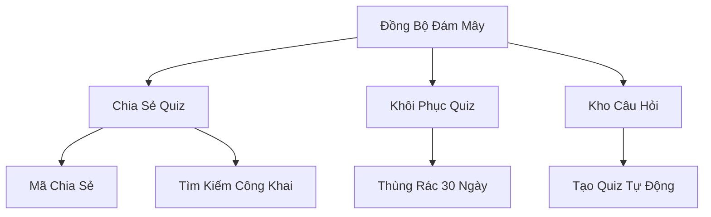

# Ứng Dụng Quiz Di Động

## 1. Tổng Quan Dự Án

**QuizCode** là ứng dụng di động Android cho phép người dùng tạo, chia sẻ và làm các bài quiz trắc nghiệm. Ứng dụng hỗ trợ cả chế độ trực tuyến (đồng bộ đám mây) và ngoại tuyến (ưu tiên lưu trữ cục bộ).

### Các Tính Năng Chính

| Tính Năng | Mô Tả |
|-----------|-------|
| Tạo Quiz | Nhập thủ công hoặc nhập hàng loạt từ Excel/CSV |
| Xáo Trộn Câu Hỏi | Ngẫu nhiên hóa câu hỏi và đáp án mỗi lần làm bài, giữ nguyên đáp án đúng |
| Mã Chia Sẻ | Mã 6 ký tự để chia sẻ quiz riêng tư |
| Thư Viện Công Khai | Duyệt và tìm kiếm quiz từ cộng đồng |
| Chế Độ Khách | Làm quiz không cần đăng ký tài khoản |
| Kho Câu Hỏi | Đóng góp câu hỏi ẩn danh để tạo quiz tự động |
| Đồng Bộ Đám Mây | Sao lưu tự động với xác minh toàn vẹn dữ liệu |

---

## 2. Công Nghệ Sử Dụng

| Tầng | Công Nghệ |
|------|-----------|
| Ngôn ngữ | Kotlin |
| Cơ sở dữ liệu cục bộ | SQLite (Room) - bộ nhớ đệm ngoại tuyến |
| UI Framework | Jetpack Compose |
| Backend | Firebase (serverless) |
| Cơ sở dữ liệu đám mây | Cloud Firestore |
| Xác thực | Firebase Auth |
| Lưu trữ | Firebase Storage (file media) |

---

## 3. Kiến Trúc Hệ Thống

```
┌─────────────────────────────────────────────────────────────────┐
│                   Ứng Dụng QuizCode Mobile                       │
│                         (Kotlin)                                 │
├─────────────────────────────────────────────────────────────────┤
│  ┌──────────────┐  ┌──────────────┐  ┌──────────────┐           │
│  │   Tầng UI    │  │  ViewModel   │  │  Repository  │           │
│  │   (Compose)  │◄─┤   (MVVM)     │◄─┤   Pattern    │           │
│  └──────────────┘  └──────────────┘  └──────┬───────┘           │
│                                             │                    │
│  ┌──────────────────────────────────────────┴───────────────┐   │
│  │                    Nguồn Dữ Liệu                          │   │
│  │  ┌─────────────────┐        ┌─────────────────┐          │   │
│  │  │  Room Database  │        │  Firebase SDK   │          │   │
│  │  │ (Cache Ngoại    │        │  (Đồng Bộ       │          │   │
│  │  │  Tuyến)         │        │   Đám Mây)      │          │   │
│  │  └────────┬────────┘        └────────┬────────┘          │   │
│  └───────────┼──────────────────────────┼───────────────────┘   │
└──────────────┼──────────────────────────┼───────────────────────┘
               │                          │
       ┌───────▼───────┐          ┌───────▼───────┐
       │  Local SQLite │          │    Firebase   │
       │    Storage    │          │     Cloud     │
       └───────────────┘          └───────────────┘
                                          │
                          ┌───────────────┼───────────────┐
                          ▼               ▼               ▼
                    ┌──────────┐   ┌──────────┐   ┌──────────┐
                    │Firestore │   │   Auth   │   │ Storage  │
                    │(Database)│   │ (Đăng    │   │ (Media)  │
                    │          │   │  nhập)   │   │          │
                    └──────────┘   └──────────┘   └──────────┘
```

---

## 4. Vai Trò Người Dùng

### 4.1 Chủ Sở Hữu (Người Dùng Đã Xác Thực)
- Tạo/chỉnh sửa/xóa quiz
- Nhập từ Excel/CSV
- Tạo mã chia sẻ 6 ký tự
- Xem thống kê làm bài
- Đóng góp câu hỏi vào kho công khai
- Tạo quiz tự động từ kho câu hỏi

### 4.2 Khách (Chưa Xác Thực)
- Tham gia quiz qua mã 6 ký tự
- Duyệt quiz công khai
- Làm quiz và xem điểm của mình
- Không cần tài khoản

---

## 5. Quy Tắc Nghiệp Vụ Chính

### Chia Sẻ Quiz
| Chế Độ | Phương Thức Truy Cập |
|--------|---------------------|
| Riêng tư | Chỉ qua mã chia sẻ 6 ký tự |
| Công khai | Có thể tìm kiếm không cần mã |

### Tags & Metadata
- Tags được đặt ở cấp quiz
- Câu hỏi kế thừa tags từ quiz theo mặc định
- Có thể ghi đè tag cho từng câu hỏi (tùy chọn)

### Hỗ Trợ Media
| Loại | Định Dạng |
|------|-----------|
| Hình ảnh | JPG, PNG, WebP |
| Video | MP4, URL Stream |

> Media hiển thị phía trên nội dung câu hỏi khi `media_url` không null.

### Kiến Trúc Lựa Chọn Linh Hoạt

Hệ thống quiz hỗ trợ **số lượng đáp án động** (từ 2 đến 10 cho mỗi câu hỏi):

| Loại Câu Hỏi | Số Lựa Chọn | Trường Hợp Sử Dụng |
|--------------|-------------|----------------------|
| Đúng/Sai | 2 | Câu hỏi nhị phân đơn giản |
| MCQ Tiêu Chuẩn | 4 | Trắc nghiệm truyền thống |
| MCQ Mở Rộng | 5-10 | Câu hỏi phức tạp với nhiều lựa chọn hơn |

**Đặc Điểm Chính:**
- **Tối thiểu**: Mỗi câu hỏi cần ít nhất 2 lựa chọn
- **Tối đa**: Mỗi câu hỏi cho phép tối đa 10 lựa chọn
- **Nhiều đáp án đúng**: Hỗ trợ tùy chọn cho câu hỏi có nhiều đáp án đúng
- **UI Động**: Các nút lựa chọn hiển thị dựa trên số lượng lựa chọn của câu hỏi
- **Xác thực**: Server và client xác thực ràng buộc số lượng lựa chọn

```
┌─────────────────────────────────────────────────────────┐
│           MÔ HÌNH LỰA CHỌN LINH HOẠT                    │
├─────────────────────────────────────────────────────────┤
│  Câu Hỏi (Question)                                     │
│  ├── choiceCount: 2-10 (linh hoạt)                      │
│  ├── allowMultipleCorrect: boolean                      │
│  │                                                       │
│  └── choices[] (2 đến 10 mục)                           │
│      ├── Lựa chọn A (isCorrect: true/false)             │
│      ├── Lựa chọn B (isCorrect: true/false)             │
│      ├── ...                                            │
│      └── Lựa chọn N (tối đa 10)                         │
└─────────────────────────────────────────────────────────┘
```

---

## 6. Thuật Toán Đồng Bộ (Sao Lưu Đám Mây)

```
┌─────────────────────────────────────────────────────────────┐
│                    Quy Trình Upload                          │
├─────────────────────────────────────────────────────────────┤
│  1. Client tính checksum SHA-256 của dữ liệu quiz            │
│  2. Upload quiz + metadata + checksum lên Firestore          │
│  3. Firestore lưu trữ dữ liệu với trường checksum            │
│  4. Client xác minh bằng cách đọc lại và so sánh checksum    │
│  5. So sánh checksums:                                       │
│     ├─ Khớp → Đánh dấu đồng bộ hoàn tất ✓                   │
│     └─ Không khớp → Xóa dữ liệu lỗi, client thử lại         │
└─────────────────────────────────────────────────────────────┘
```

### Lợi Ích
- **Toàn Vẹn Dữ Liệu**: Phát hiện lỗi từ mạng
- **An Toàn Khi Thử Lại**: Client có thể upload lại an toàn khi thất bại
- **Lưu Trữ Sạch**: Không có dữ liệu lỗi/một phần tồn tại
- **Ưu Tiên Ngoại Tuyến**: Firestore tự động xử lý cache ngoại tuyến

---

## 7. Phụ Thuộc Tính Năng



<details>
<summary>📊 Xem dạng Text (nếu Mermaid không hiển thị)</summary>

```
                    Đồng Bộ Đám Mây
                   /       |       \
                  ▼        ▼        ▼
          Chia Sẻ Quiz  Khôi Phục  Kho Câu Hỏi
             /    \       Quiz         │
            ▼      ▼        │          ▼
      Mã Chia   Tìm Kiếm    │    Tạo Quiz Tự Động
        Sẻ     Công Khai    ▼
                      Thùng Rác 30 Ngày
```

</details>

---

## 8. Các Module Dự Án

| Module | Chức Năng |
|--------|-----------|
| `app` | Entry point chính của ứng dụng Android |
| `ui` | Các màn hình và component Compose |
| `data` | Room entities, Firebase models, repositories |
| `firebase` | Firebase Auth, Firestore, Storage wrappers |
| `sync` | Logic đồng bộ nền, xác minh checksum |
| `utils` | Helpers, extensions, constants |

---

## 9. Tổng Kết Dịch Vụ Firebase

| Dịch Vụ | Sử Dụng |
|---------|---------|
| **Firebase Auth** | Đăng nhập email/mật khẩu, Google Sign-In |
| **Cloud Firestore** | Quiz, câu hỏi, lượt làm, dữ liệu người dùng |
| **Firebase Storage** | Upload hình ảnh/video cho câu hỏi |
| **Cloud Functions** (tùy chọn) | Tạo mã chia sẻ, công việc dọn dẹp 30 ngày |
