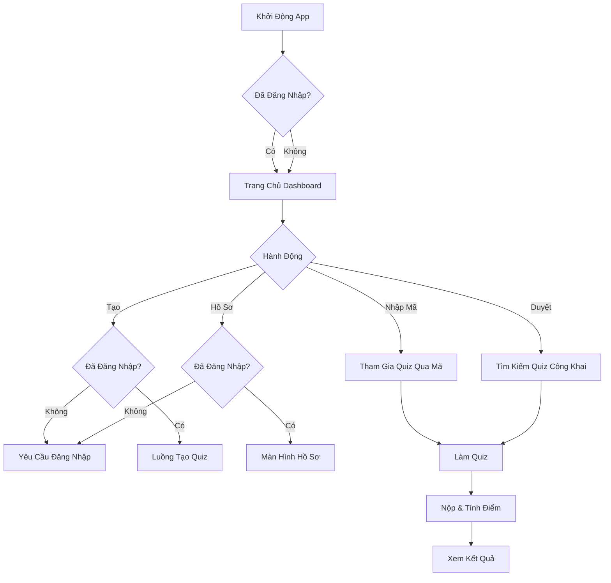
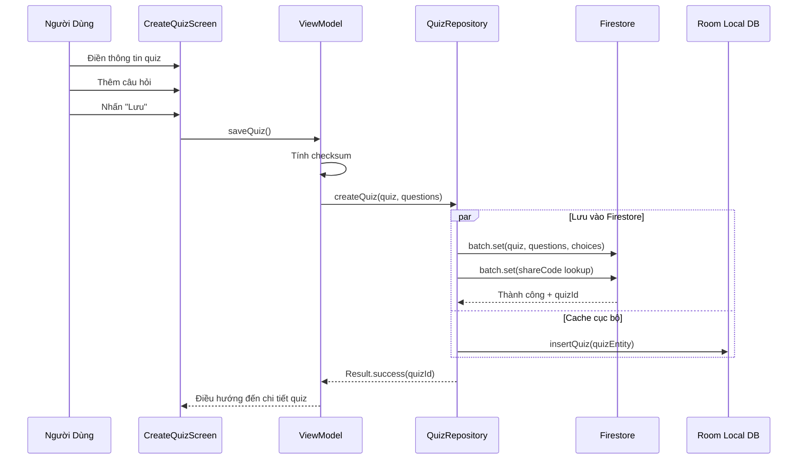
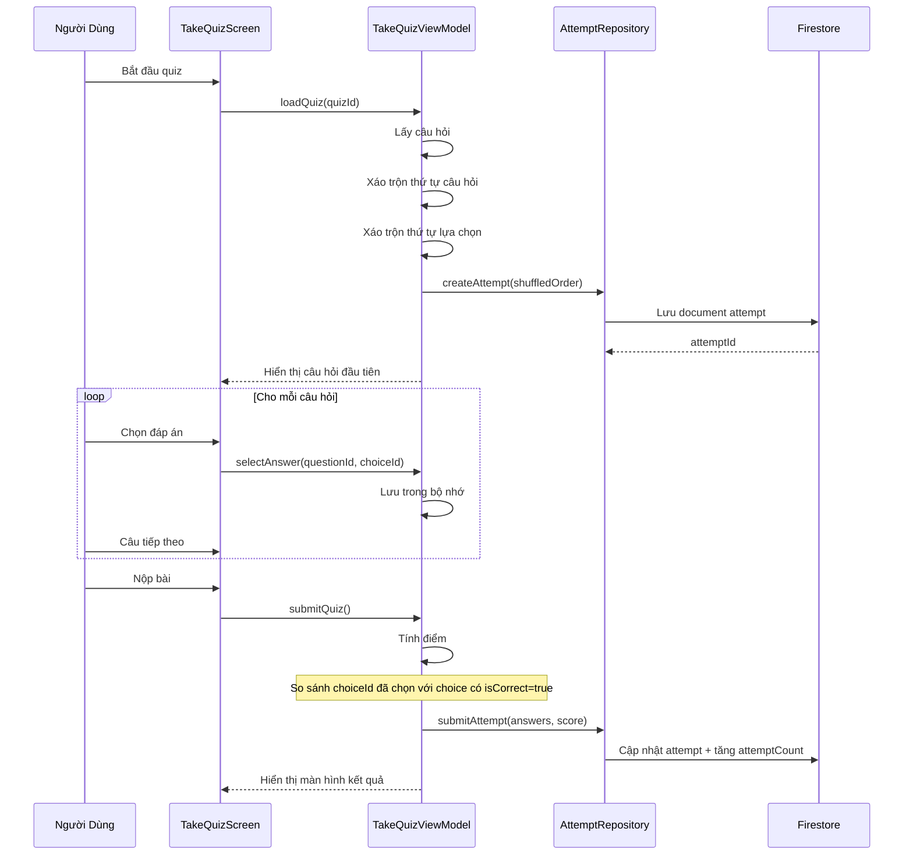
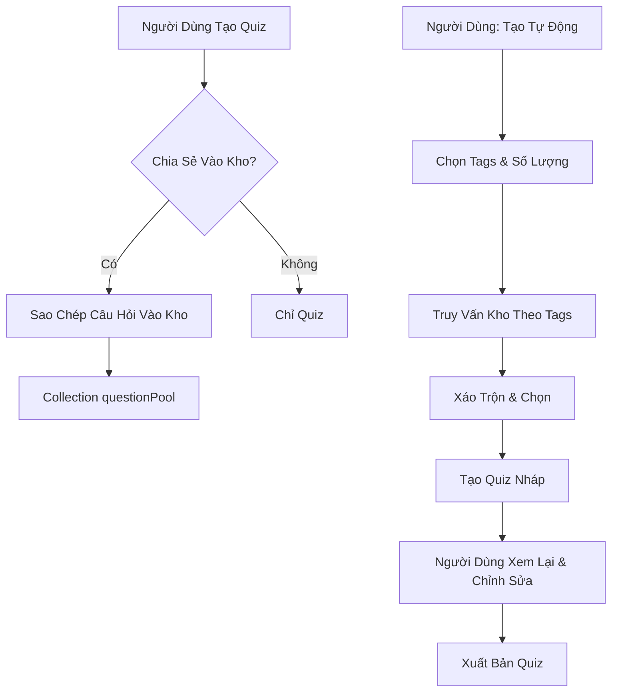

# Hành Vi Ứng Dụng & Logic Nghiệp Vụ

## 1. Tổng Quan Luồng Ứng Dụng



<details>
<summary>📊 Xem dạng Text (nếu Mermaid không hiển thị)</summary>

```
                      Khởi Động App
                            │
                            ▼
                    Đã Đăng Nhập?
                      /         \
                    Có          Không
                      \         /
                       ▼       ▼
                  Trang Chủ Dashboard
                          │
                          ▼
                     Hành Động
           ┌────────┬─────┴────┬────────┐
           ▼        ▼          ▼        ▼
      Nhập Mã    Duyệt       Tạo     Hồ Sơ
           │        │          │        │
           │        │     Đăng Nhập? Đăng Nhập?
           │        │       /   \     /   \
           │        │    Không  Có  Không  Có
           │        │      │     │    │     │
           │        │      ▼     ▼    ▼     ▼
           │        │   Đăng   Tạo  Đăng   Hồ Sơ
           │        │   Nhập   Quiz Nhập
           ▼        ▼
  Tham Gia Quiz ──► Tìm Kiếm Quiz Công Khai
                │                    │
                └──────────┬─────────┘
                           ▼
                       Làm Quiz
                           │
                           ▼
                   Nộp & Tính Điểm
                           │
                           ▼
                      Xem Kết Quả
```

</details>

---

## 2. Kiến Trúc Luồng Dữ Liệu

### 2.1 Local-First với Cloud Sync

```
┌─────────────────────────────────────────────────────────────────┐
│                      HÀNH ĐỘNG NGƯỜI DÙNG                        │
│                   (Tạo/Sửa/Xóa Quiz)                            │
└─────────────────────────────────────┬───────────────────────────┘
                                      │
                                      ▼
┌─────────────────────────────────────────────────────────────────┐
│                   1. LƯU VÀO ROOM (Cục Bộ)                       │
│                       Phản hồi ngay lập tức                      │
│                       syncStatus = PENDING                       │
└─────────────────────────────────────┬───────────────────────────┘
                                      │
                                      ▼
┌─────────────────────────────────────────────────────────────────┐
│                  2. KÍCH HOẠT ĐỒNG BỘ ĐÁM MÂY                    │
│             (Chạy nền - WorkManager / Coroutine)                │
└─────────────────────────────────────┬───────────────────────────┘
                                      │
              ┌───────────────────────┴───────────────────────┐
              │                                               │
              ▼                                               ▼
┌─────────────────────────┐                   ┌─────────────────────────┐
│   CÓ MẠNG               │                   │   KHÔNG CÓ MẠNG         │
│                         │                   │                         │
│ - Tính checksum         │                   │ - Giữ syncStatus =      │
│ - Upload lên Firestore  │                   │   PENDING               │
│ - Xác minh checksum     │                   │ - Thử lại khi có mạng  │
│ - Cập nhật syncStatus   │                   │                         │
└─────────────────────────┘                   └─────────────────────────┘
```

### 2.2 Luồng Đọc Dữ Liệu

```
┌─────────────────────────────────────────────────────────────────┐
│                  NGƯỜI DÙNG YÊU CẦU DỮ LIỆU                      │
│                  (vd: Xem Quiz Của Tôi)                         │
└─────────────────────────────────────┬───────────────────────────┘
                                      │
                                      ▼
┌─────────────────────────────────────────────────────────────────┐
│               FIRESTORE SNAPSHOT LISTENER                        │
│          (Cập nhật real-time khi kết nối)                       │
└─────────────────────────────────────┬───────────────────────────┘
                                      │
              ┌───────────────────────┴───────────────────────┐
              │                                               │
              ▼                                               ▼
┌─────────────────────────┐                   ┌─────────────────────────┐
│   CHẾ ĐỘ ONLINE         │                   │   CHẾ ĐỘ OFFLINE        │
│                         │                   │                         │
│ - Lấy từ Firestore      │                   │ - Firestore phục vụ     │
│ - Cache vào Room        │                   │   từ cache cục bộ       │
│ - Hiển thị cho user     │                   │ - Fallback về Room      │
└─────────────────────────┘                   └─────────────────────────┘
```

---

## 3. Các Tính Năng Chính - Cách Hoạt Động

### 3.1 Tạo Quiz



<details>
<summary>📊 Xem dạng Text (nếu Mermaid không hiển thị)</summary>

```
Người Dùng    CreateQuizScreen    ViewModel       QuizRepository      Firestore      Room
     │               │                │                 │                  │           │
     │──Điền────────►│                │                 │                  │           │
     │  thông tin    │                │                 │                  │           │
     │──Thêm────────►│                │                 │                  │           │
     │  câu hỏi      │                │                 │                  │           │
     │──Nhấn────────►│                │                 │                  │           │
     │  "Lưu"        │──saveQuiz()───►│                 │                  │           │
     │               │                │──Tính checksum──│                  │           │
     │               │                │──createQuiz()──►│                  │           │
     │               │                │                 │                  │           │
     │               │                │                 │  ┌───PARALLEL───┐│           │
     │               │                │                 │──┼──batch.set()─┼──────────►│
     │               │                │                 │◄─┼──Thành công──┼───────────│
     │               │                │                 │──┼──insert()────┼───────────────────►│
     │               │                │                 │  └──────────────┘│           │
     │               │                │◄──Result.success(quizId)──│        │           │
     │               │◄──Điều hướng───│                 │          │        │           │
```

</details>

**Quy Tắc Nghiệp Vụ:**
1. Quiz phải có ít nhất 1 câu hỏi
2. Mỗi câu hỏi phải có **từ 2 đến 10 lựa chọn** (linh hoạt, không cố định)
3. Ít nhất 1 lựa chọn phải được đánh dấu là đáp án đúng (hỗ trợ một hoặc nhiều đáp án đúng)
4. Mã chia sẻ được tạo tự động (6 ký tự chữ và số)
5. Checksum được tính từ: tiêu đề + mô tả + tất cả câu hỏi + tất cả lựa chọn

> **Lưu ý:** Hệ thống lựa chọn linh hoạt cho phép người tạo quiz thiết kế câu hỏi với độ phức tạp khác nhau - từ câu hỏi Đúng/Sai đơn giản (2 lựa chọn) đến câu hỏi toàn diện với tối đa 10 lựa chọn.

---

### 3.2 Chia Sẻ Quiz (Mã Chia Sẻ)

```
┌─────────────────────────────────────────────────────────────────┐
│                    HỆ THỐNG MÃ CHIA SẺ                           │
├─────────────────────────────────────────────────────────────────┤
│                                                                  │
│  quizzes/{quizId}                                               │
│  ├── shareCode: "ABC123"                                        │
│  └── isPublic: false                                            │
│                                                                  │
│  shareCodes/ABC123                 ◄─── Collection tra cứu nhanh│
│  └── quizId: "{quizId}"                                         │
│                                                                  │
├─────────────────────────────────────────────────────────────────┤
│  QUY TRÌNH:                                                      │
│  1. Người dùng nhập "ABC123"                                     │
│  2. App truy vấn shareCodes/ABC123                              │
│  3. Lấy được quizId                                              │
│  4. Lấy quiz từ quizzes/{quizId}                                │
│  5. Người dùng có thể làm quiz                                   │
└─────────────────────────────────────────────────────────────────┘
```

**Quy Tắc Hiển Thị:**

| isPublic | shareCode | Quyền Truy Cập |
|----------|-----------|----------------|
| `false` | Bắt buộc | Chỉ người có mã 6 ký tự mới truy cập được |
| `true` | Tùy chọn | Xuất hiện trong tìm kiếm công khai, mã vẫn hoạt động |

**Tạo Lại Mã:**
- Chủ sở hữu có thể tạo mã mới bất cứ lúc nào
- Mã cũ bị xóa khỏi collection `shareCodes`
- Mã mới được tạo
- Ai có mã cũ không thể truy cập nữa

---

### 3.3 Làm Quiz (Xáo Trộn & Tính Điểm)



<details>
<summary>📊 Xem dạng Text (nếu Mermaid không hiển thị)</summary>

```
Người Dùng   TakeQuizScreen   TakeQuizViewModel   AttemptRepository   Firestore
     │             │                  │                    │               │
     │──Bắt đầu───►│                  │                    │               │
     │   quiz      │──loadQuiz()─────►│                    │               │
     │             │                  │──Lấy câu hỏi───────│               │
     │             │                  │──Xáo trộn câu hỏi──│               │
     │             │                  │──Xáo trộn lựa chọn─│               │
     │             │                  │──createAttempt()──►│               │
     │             │                  │                    │──Lưu attempt─►│
     │             │                  │                    │◄──attemptId───│
     │             │◄──Hiển thị Q1────│                    │               │
     │             │                  │                    │               │
     │  ┌─────────LOOP: Cho mỗi câu hỏi────────────────────────────────┐
     │  │          │                  │                    │              │
     │──┼─Chọn────►│                  │                    │              │
     │  │ đáp án   │──selectAnswer()─►│                    │              │
     │  │          │                  │──Lưu trong bộ nhớ──│              │
     │──┼─Câu─────►│                  │                    │              │
     │  │ tiếp     │                  │                    │              │
     │  └──────────────────────────────────────────────────────────────┘
     │             │                  │                    │               │
     │──Nộp bài──►│                  │                    │               │
     │             │──submitQuiz()───►│                    │               │
     │             │                  │──Tính điểm─────────│               │
     │             │                  │──submitAttempt()──►│               │
     │             │                  │                    │──Cập nhật────►│
     │             │◄──Hiển thị kết quả│                   │               │
```

</details>

**Thuật Toán Xáo Trộn:**
```kotlin
// 1. Xáo trộn câu hỏi
val shuffledQuestions = questions.shuffled()
val questionOrder = shuffledQuestions.map { it.id }

// 2. Xáo trộn lựa chọn cho mỗi câu hỏi
val choiceOrders = shuffledQuestions.associate { q ->
    q.id to q.choices.shuffled().map { it.id }
}

// 3. Lưu thứ tự trong document attempt
attempt = Attempt(
    questionOrder = questionOrder,      // ["q3", "q1", "q5", ...]
    choiceOrders = choiceOrders         // {"q3": ["c2","c0","c3","c1"], ...}
)
```

**Logic Tính Điểm:**
```kotlin
var score = 0
questions.forEach { question ->
    val userChoice = answers[question.id]       // choiceId người dùng chọn
    val correctChoice = question.choices.find { it.isCorrect }
    if (userChoice == correctChoice?.id) {
        score += question.points
    }
}
```

**Dữ Liệu Được Lưu:**
- `questionOrder`: Mảng ID câu hỏi theo thứ tự đã xáo trộn
- `choiceOrders`: Map questionId → mảng choiceId theo thứ tự đã xáo trộn
- `answers`: Map questionId → choiceId đã chọn
- `score`: Điểm số cuối cùng
- `startedAt` / `finishedAt`: Timestamps để tính thời gian làm bài

---

### 3.4 Đồng Bộ Đám Mây với Xác Minh Checksum

```
┌─────────────────────────────────────────────────────────────────┐
│                 UPLOAD VỚI KIỂM TRA TOÀN VẸN                     │
├─────────────────────────────────────────────────────────────────┤
│                                                                  │
│  CLIENT                                      FIRESTORE           │
│  ───────                                     ─────────           │
│                                                                  │
│  1. Xây dựng dữ liệu quiz                                        │
│     ┌─────────────────┐                                         │
│     │ title           │                                         │
│     │ description     │                                         │
│     │ questions[]     │                                         │
│     │ └─ choices[]    │                                         │
│     └─────────────────┘                                         │
│                                                                  │
│  2. Tính checksum SHA-256 ───────────────────┐                  │
│     checksum = SHA256(title + desc +          │                  │
│                       questions + choices)    │                  │
│                                               ▼                  │
│  3. Upload data + checksum ─────────────────► LƯU               │
│                                                                  │
│  4. Đọc lại document ◄───────────────────── ĐỌC                 │
│                                                                  │
│  5. So sánh checksums                                            │
│     ┌──────────────────────────────────────┐                    │
│     │ localChecksum == remoteChecksum?     │                    │
│     │ ├─ CÓ  → syncStatus = SYNCED ✓       │                    │
│     │ └─ KHÔNG → Xóa + Thử lại ✗           │                    │
│     └──────────────────────────────────────┘                    │
│                                                                  │
└─────────────────────────────────────────────────────────────────┘
```

**Tại Sao Cần Checksum?**
- Lỗi mạng có thể làm hỏng dữ liệu khi upload
- Upload một phần có thể thành công (quiz lưu, nhưng thiếu câu hỏi)
- Checksum đảm bảo TẤT CẢ dữ liệu được truyền đúng
- Nếu không khớp: xóa dữ liệu lỗi, client thử lại từ đầu

**Tính Checksum:**
```kotlin
fun computeChecksum(quiz: Quiz, questions: List<Question>): String {
    val data = buildString {
        append(quiz.title)
        append(quiz.description ?: "")
        questions.sortedBy { it.position }.forEach { q ->
            append(q.content)
            append(q.mediaUrl ?: "")
            q.choices.sortedBy { it.position }.forEach { c ->
                append(c.content)
                append(c.isCorrect)
            }
        }
    }
    return MessageDigest.getInstance("SHA-256")
        .digest(data.toByteArray())
        .joinToString("") { "%02x".format(it) }
}
```

---

### 3.5 Khôi Phục Quiz (Thùng Rác 30 Ngày)

```
┌─────────────────────────────────────────────────────────────────┐
│                    HỆ THỐNG XÓA MỀM                              │
├─────────────────────────────────────────────────────────────────┤
│                                                                  │
│  QUIZ HOẠT ĐỘNG                       QUIZ ĐÃ XÓA               │
│  ─────────────                        ──────────                │
│  deletedAt: null                      deletedAt: 2024-01-15     │
│                                                                  │
│                          XÓA                                     │
│           ─────────────────────────────────►                    │
│                                                                  │
│                        KHÔI PHỤC                                 │
│           ◄─────────────────────────────────                    │
│                                                                  │
├─────────────────────────────────────────────────────────────────┤
│                                                                  │
│  QUY TRÌNH DỌN DẸP (Cloud Function - chạy hàng ngày):          │
│                                                                  │
│  1. Truy vấn quizzes WHERE deletedAt < (hiện tại - 30 ngày)    │
│  2. Xóa vĩnh viễn quiz + questions + choices                   │
│  3. Xóa khỏi collection shareCodes                              │
│                                                                  │
└─────────────────────────────────────────────────────────────────┘
```

**Hành Động Người Dùng:**
| Hành Động | Hiệu Lực |
|-----------|----------|
| Xóa Quiz | Đặt `deletedAt = Timestamp.now()` |
| Xem Thùng Rác | Truy vấn where `deletedAt IS NOT NULL` |
| Khôi Phục Quiz | Đặt `deletedAt = null` |
| Xóa Vĩnh Viễn | (Tự động) Sau 30 ngày, dữ liệu bị xóa hoàn toàn |

**Tại Sao Giữ Lại Phía Server?**
- Người dùng vô tình xóa → có thể khôi phục trong 30 ngày
- Xóa cục bộ chỉ xóa khỏi thiết bị
- Bản sao đám mây vẫn còn để khôi phục
- Sau 30 ngày: tự động dọn dẹp để tiết kiệm dung lượng

---

### 3.6 Kho Câu Hỏi & Tạo Tự Động



<details>
<summary>📊 Xem dạng Text (nếu Mermaid không hiển thị)</summary>

```
LUỒNG ĐÓNG GÓP:                      LUỒNG TẠO TỰ ĐỘNG:
                                      
Người Dùng Tạo Quiz              Người Dùng: Tạo Tự Động
       │                                    │
       ▼                                    ▼
 Chia Sẻ Vào Kho?                  Chọn Tags & Số Lượng
    /     \                                 │
   Có     Không                             ▼
    │        │                     Truy Vấn Kho Theo Tags
    ▼        ▼                              │
Sao Chép   Chỉ                              ▼
Vào Kho    Quiz                    Xáo Trộn & Chọn
    │                                       │
    ▼                                       ▼
questionPool                        Tạo Quiz Nháp
Collection                                  │
                                            ▼
                                  Xem Lại & Chỉnh Sửa
                                            │
                                            ▼
                                      Xuất Bản Quiz
```

</details>

**Quy Trình Đóng Góp:**
1. Người dùng tạo hoặc nhập quiz
2. Checkbox: "Chia sẻ câu hỏi vào kho cộng đồng (ẩn danh)"
3. Nếu chọn: câu hỏi được sao chép vào collection `questionPool`
4. `contributorId` = null nếu ẩn danh, ngược lại = userId
5. `sourceQuizId` theo dõi nguồn gốc để phân tích

**Quy Trình Tạo Tự Động:**
1. Người dùng mở "Tạo Quiz Tự Động"
2. Chọn: Tags (Toán, Khoa Học, v.v.) + Số câu hỏi (10, 20, v.v.)
3. App truy vấn `questionPool` where `isActive = true` AND `tags` chứa tags đã chọn
4. Xáo trộn kết quả, lấy số lượng yêu cầu
5. Tạo quiz mới dạng Nháp (chưa xuất bản)
6. Người dùng có thể chỉnh sửa, xóa câu hỏi, thêm câu mới
7. Người dùng xuất bản → quiz bình thường

**Thu Hồi Đóng Góp:**
- Người dùng có thể thu hồi câu hỏi đã đóng góp bất cứ lúc nào
- Đặt `isActive = false` cho các entry trong kho
- Quiz đã tạo sử dụng những câu hỏi đó KHÔNG bị ảnh hưởng
- Chỉ tạo tự động trong tương lai mới loại trừ chúng

---

### 3.7 Chế Độ Khách

```
┌─────────────────────────────────────────────────────────────────┐
│                       CHẾ ĐỘ KHÁCH                               │
├─────────────────────────────────────────────────────────────────┤
│                                                                  │
│  KHÁCH CÓ THỂ LÀM:                     KHÁCH KHÔNG THỂ LÀM:     │
│  ─────────────────────                 ────────────────────     │
│  ✓ Nhập mã 6 ký tự                     ✗ Tạo quiz               │
│  ✓ Duyệt quiz công khai                ✗ Chỉnh sửa quiz         │
│  ✓ Làm bất kỳ quiz có quyền            ✗ Xem lịch sử làm bài    │
│  ✓ Xem điểm sau khi làm                ✗ Đóng góp vào kho       │
│  ✓ Xem lại đáp án (nếu bật)            ✗ Truy cập hồ sơ         │
│                                                                  │
├─────────────────────────────────────────────────────────────────┤
│                                                                  │
│  THEO DÕI ATTEMPT CỦA KHÁCH:                                     │
│                                                                  │
│  userId = "guest_" + UUID.randomUUID()                          │
│  Ví dụ: "guest_a1b2c3d4-e5f6-7890-abcd-ef1234567890"           │
│                                                                  │
│  - Lưu trong document attempt                                    │
│  - Không có danh tính persistent qua các phiên                   │
│  - Chủ quiz có thể thấy "X lượt làm của khách" trong thống kê   │
│                                                                  │
└─────────────────────────────────────────────────────────────────┘
```

---

## 4. Chế Độ Tiết Kiệm Dữ Liệu

```
┌─────────────────────────────────────────────────────────────────┐
│                    CHẾ ĐỘ TIẾT KIỆM DỮ LIỆU                      │
├─────────────────────────────────────────────────────────────────┤
│                                                                  │
│  CÀI ĐẶT: Cài Đặt → Chế Độ Tiết Kiệm Dữ Liệu [Bật/Tắt]        │
│                                                                  │
│  HÀNH VI:                                                        │
│                                                                  │
│  ┌─────────────────────────────────────────────────────────┐   │
│  │              TIẾT KIỆM DỮ LIỆU = TẮT                    │   │
│  │                                                          │   │
│  │  - Đồng bộ trên mọi mạng (WiFi hoặc Dữ Liệu Di Động)   │   │
│  │  - Firestore listener real-time luôn hoạt động          │   │
│  │  - Media tải ngay lập tức                               │   │
│  └─────────────────────────────────────────────────────────┘   │
│                                                                  │
│  ┌─────────────────────────────────────────────────────────┐   │
│  │              TIẾT KIỆM DỮ LIỆU = BẬT                    │   │
│  │                                                          │   │
│  │  - Đồng bộ CHỈ trên mạng không đo lường (WiFi)         │   │
│  │  - Các đồng bộ đang chờ sẽ đợi WiFi                     │   │
│  │  - Giảm sử dụng dữ liệu nền                             │   │
│  └─────────────────────────────────────────────────────────┘   │
│                                                                  │
└─────────────────────────────────────────────────────────────────┘
```

**Triển Khai:**
```kotlin
val networkConstraint = if (dataSaverEnabled) {
    NetworkType.UNMETERED  // Chỉ WiFi
} else {
    NetworkType.CONNECTED  // Mọi mạng
}
```

---

## 5. Logic Nhập Excel/CSV

```
┌─────────────────────────────────────────────────────────────────┐
│                    QUY TRÌNH NHẬP CSV                            │
├─────────────────────────────────────────────────────────────────┤
│                                                                  │
│  ĐỊNH DẠNG YÊU CẦU:                                              │
│  ────────────────                                               │
│  question,option_0,option_1,option_2,option_3,correct_option    │
│  "Thủ đô VN?","TPHCM","Hà Nội","Đà Nẵng","Huế",1               │
│  "2+2=?","3","4","5","6",1                                      │
│                                                                  │
│  CỘT TÙY CHỌN:                                                   │
│  question_id, media_url, points, explanation                    │
│                                                                  │
├─────────────────────────────────────────────────────────────────┤
│                                                                  │
│  QUY TẮC XÁC THỰC:                                               │
│  ──────────────────                                             │
│  1. Các header bắt buộc phải tồn tại                            │
│  2. correct_option phải là 0, 1, 2, hoặc 3                      │
│  3. Nội dung câu hỏi không được trống                           │
│  4. Tất cả 4 lựa chọn phải có giá trị                           │
│                                                                  │
│  XỬ LÝ LỖI:                                                      │
│  ───────────                                                    │
│  - Các dòng không hợp lệ bị bỏ qua                              │
│  - Danh sách lỗi hiển thị cho user: "Dòng 5: correct_option    │
│    không hợp lệ"                                                │
│  - Người dùng có thể tiếp tục với các dòng hợp lệ              │
│                                                                  │
└─────────────────────────────────────────────────────────────────┘
```

---

## 6. Tóm Tắt Quy Tắc Bảo Mật

| Collection | Đọc | Ghi |
|------------|-----|-----|
| `users` | Người dùng đã xác thực | Chỉ document của mình |
| `quizzes` | Công khai HOẶC chủ sở hữu | Chỉ chủ sở hữu |
| `quizzes/{id}/questions` | Giống quiz cha | Chỉ chủ sở hữu |
| `attempts` | Attempt của mình HOẶC chủ quiz | Người tạo (bao gồm khách) |
| `shareCodes` | Ai cũng được | Chỉ Cloud Functions |
| `questionPool` | Chỉ entry đang hoạt động | Đã xác thực (đóng góp), Người đóng góp (thu hồi) |

---

## 7. Chiến Lược Xử Lý Lỗi

| Tình Huống | Xử Lý |
|------------|-------|
| Lỗi mạng khi đồng bộ | Xếp hàng để thử lại, hiển thị indicator đang chờ đồng bộ |
| Firestore ngoại tuyến | Sử dụng dữ liệu đã cache, xếp hàng ghi cho sau |
| Định dạng CSV không hợp lệ | Hiển thị danh sách lỗi, cho phép nhập một phần |
| Không tìm thấy quiz (sai mã) | Thông báo "Không tìm thấy quiz" |
| Checksum không khớp | Xóa dữ liệu lỗi, tự động thử upload lại |
| Xác thực hết hạn | Yêu cầu đăng nhập lại, giữ nguyên dữ liệu nháp |

---

## 8. Tóm Tắt Quản Lý State

| State | Lưu Trữ | Persistence |
|-------|---------|-------------|
| UI State | ViewModel + StateFlow | Chỉ trong bộ nhớ |
| Phiên Người Dùng | Firebase Auth | Persistent (tự động refresh) |
| Dữ Liệu Quiz | Firestore + Room cache | Persistent + Đồng bộ |
| Dữ Liệu Attempt | Firestore | Persistent |
| Cài Đặt | DataStore | Persistent |
| Đồng Bộ Đang Chờ | Room (trường syncStatus) | Persistent cho đến khi đồng bộ |
