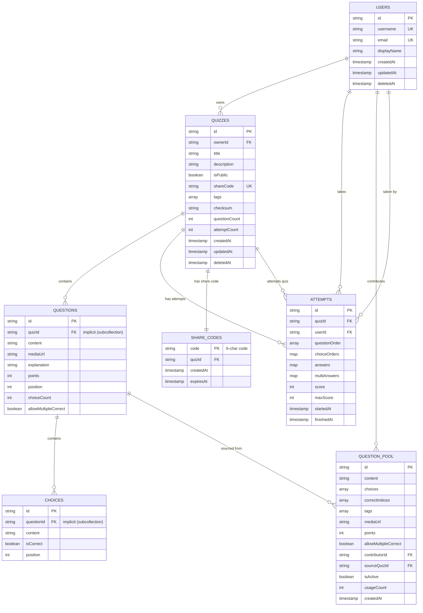

# Firestore Database Schema Relationships

## Entity Relationship Diagram



## Collection Hierarchy

```
firestore/
├── users/
│   └── {userId}                          [Root Collection]
│
├── quizzes/
│   └── {quizId}                          [Root Collection]
│       └── questions/                    [Subcollection]
│           └── {questionId}
│               └── choices/              [Subcollection]
│                   └── {choiceId}
│
├── attempts/
│   └── {attemptId}                       [Root Collection]
│
├── questionPool/
│   └── {poolId}                          [Root Collection]
│
└── shareCodes/
    └── {shareCode}                       [Root Collection - Lookup]
```

## Relationship Details

### 1. User Relationships

| Relationship | Type | Description |
|--------------|------|-------------|
| User → Quizzes | One-to-Many | A user can own multiple quizzes |
| User → Attempts | One-to-Many | A user can take multiple attempts |
| User → QuestionPool | One-to-Many | A user can contribute multiple questions |

### 2. Quiz Relationships

| Relationship | Type | Description |
|--------------|------|-------------|
| Quiz → Questions | One-to-Many (Subcollection) | A quiz contains multiple questions |
| Quiz → Attempts | One-to-Many | A quiz can have multiple attempts |
| Quiz → ShareCodes | One-to-One | Each quiz has one unique share code |
| Quiz → User (owner) | Many-to-One | Each quiz is owned by one user |

### 3. Question Relationships

| Relationship | Type | Description |
|--------------|------|-------------|
| Question → Choices | One-to-Many (Subcollection) | A question has 2-10 choices |
| Question → Quiz | Many-to-One (Implicit) | Each question belongs to one quiz |
| Question → QuestionPool | One-to-Many | Questions can be sourced to pool |

### 4. Attempt Relationships

| Relationship | Type | Description |
|--------------|------|-------------|
| Attempt → Quiz | Many-to-One | Each attempt is for one quiz |
| Attempt → User | Many-to-One | Each attempt is by one user |
| Attempt → Questions | Many-to-Many | References multiple questions via maps |
| Attempt → Choices | Many-to-Many | References selected choices via maps |

### 5. QuestionPool Relationships

| Relationship | Type | Description |
|--------------|------|-------------|
| QuestionPool → User | Many-to-One | Each question contributed by one user |
| QuestionPool → Quiz | Many-to-One | Each question sourced from one quiz |

### 6. ShareCodes Relationships

| Relationship | Type | Description |
|--------------|------|-------------|
| ShareCode → Quiz | One-to-One | Each code maps to exactly one quiz |

## Data Access Patterns

### Common Queries

```typescript
// 1. Get all public quizzes (paginated)
db.collection('quizzes')
  .where('isPublic', '==', true)
  .orderBy('createdAt', 'desc')
  .limit(20)

// 2. Get user's owned quizzes
db.collection('quizzes')
  .where('ownerId', '==', userId)
  .orderBy('createdAt', 'desc')

// 3. Find quiz by share code (fast lookup)
db.collection('shareCodes')
  .doc(shareCode)
  .get()
  .then(doc => doc.data().quizId)

// 4. Get quiz with all questions and choices
const quizRef = db.collection('quizzes').doc(quizId)
const questionsSnapshot = await quizRef
  .collection('questions')
  .orderBy('position')
  .get()

for (const questionDoc of questionsSnapshot.docs) {
  const choicesSnapshot = await questionDoc.ref
    .collection('choices')
    .orderBy('position')
    .get()
}

// 5. Get user's attempt history
db.collection('attempts')
  .where('userId', '==', userId)
  .orderBy('startedAt', 'desc')
  .limit(10)

// 6. Get all attempts for a quiz (for owner)
db.collection('attempts')
  .where('quizId', '==', quizId)
  .orderBy('startedAt', 'desc')

// 7. Get active questions from pool by tag
db.collection('questionPool')
  .where('isActive', '==', true)
  .where('tags', 'array-contains', 'mathematics')
  .orderBy('usageCount', 'desc')
```

## Data Integrity Rules

### Constraints

1. **Users**
   - `username` must be unique across all users
   - `email` must be unique and valid format

2. **Quizzes**
   - `shareCode` must be unique (6 uppercase alphanumeric)
   - `questionCount` must match actual subcollection count
   - `ownerId` must reference existing user

3. **Questions**
   - `position` must be unique within a quiz
   - `choiceCount` must be 2-10
   - Must have at least one correct choice

4. **Choices**
   - `position` must be unique within a question
   - At least one choice per question must have `isCorrect=true`
   - For `allowMultipleCorrect=false`, exactly one choice should be correct

5. **Attempts**
   - `userId` can be authenticated user or "guest_" prefixed ID
   - `score` ≤ `maxScore`
   - `finishedAt` ≥ `startedAt` when completed

6. **QuestionPool**
   - `sourceQuizId` must reference existing quiz
   - `choices` array must have 2-10 items
   - `correctIndices` must point to valid choice indices

7. **ShareCodes**
   - Document ID must be exactly 6 characters [A-Z0-9]
   - `quizId` must reference existing quiz

## Cascade Delete Rules

When a parent document is deleted:

1. **User Deletion**
   - Quizzes: Set `deletedAt` timestamp (soft delete)
   - Attempts: Keep (for data integrity)
   - QuestionPool: Anonymize (`contributorId` → null)

2. **Quiz Deletion**
   - Questions subcollection: Delete all
   - Choices subcollection: Delete all (cascade from questions)
   - ShareCodes: Delete corresponding share code document
   - Attempts: Keep (for historical data)
   - QuestionPool: Keep (mark `isActive=false`)

3. **Question Deletion**
   - Choices subcollection: Delete all
   - Attempts: Keep (answers remain for historical reference)

## Indexes Required

See individual schema files for detailed index definitions. Key composite indexes:

1. `quizzes`: `(isPublic, createdAt DESC)`
2. `quizzes`: `(tags CONTAINS, createdAt DESC)`
3. `attempts`: `(userId, startedAt DESC)`
4. `attempts`: `(quizId, startedAt DESC)`
5. `questionPool`: `(isActive, createdAt DESC)`
6. `questionPool`: `(tags CONTAINS, usageCount DESC)`

## Notes

- All timestamps use Firestore `Timestamp` type
- Subcollections (questions/choices) are implicit relationships through document paths
- Guest users have IDs formatted as `guest_{8-char-hash}`
- Share codes are uppercase for easy communication
- Soft deletes use `deletedAt` field instead of hard deletion
